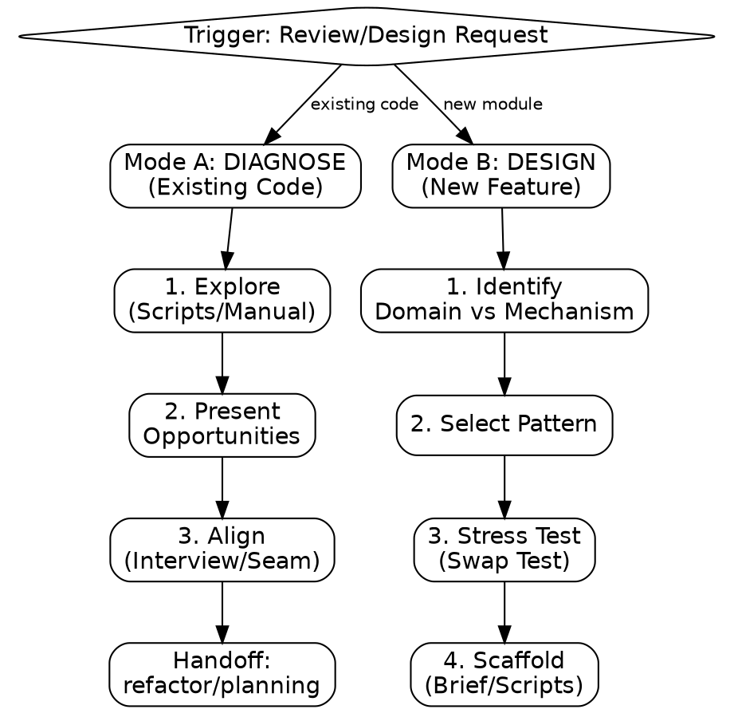

# architecture

**trigger:** Architecture review, design request, or structural issues (God modules, circular deps).

**action: Route & Confirm**
Route and confirm via `AskUserQuestion` (or 3-option markdown block):

1. ✅ **Recommended** — [Concrete Answer] based on [evidence: imports, size, churn].
2. **Alternative** — [Plausible Option] + condition for use.
3. **Other** — Custom response.

**routing:**
| Mode | Focus |
| :--- | :--- |
| **A: DIAGNOSE** | Existing code. God modules, bleed, git coupling, circular deps. |
| **B: DESIGN** | New feature/module. Boundary integrity, reversibility, patterns. |

**action: MODE A — DIAGNOSE**

1. **Explore**:
   - Detect tech stack.
   - Run `check_locality.py`, `detect_bleed.py`, `git_coupling.py`, `detect_hotspots.py`.
   - **Fallback**: Manually analyze imports, "God" modules (>500 lines/20+ exports), and history.
   - Dispatch `general-purpose` agent using `references/dispatch-template.md`.
2. **Present**: List 3-6 opportunities: [Name], [Files], [Bleed], [Deepening], [Impact], [Risk], [Mermaid].
3. **Align**:
   - Interview via `references/DOMAIN_INTERVIEW.md`.
   - Propose Seam: Interface definition, data flow, "Before vs After" Mermaid graph.
   - Write `architecture-brief.json`.
   - Handoff to `refactor` or `planning`.

**action: MODE B — DESIGN**

1. **Diagnose**: Identify Core Domain vs Mechanism.
2. **Select Pattern**: Use `references/architecture-patterns.md`.
3. **Stress Test**: Apply Swap Test (If [mechanism] changes, what breaks?).
4. **Scaffold**: Write `architecture-brief.json`. Run `scaffold_boundary.py` or manually create structure.

**heuristics:**

- **Deletion:** Would removal scatter complexity across callers?
- **Seam:** Is logic testable without I/O (DB/HTTP)?
- **Locality:** Can module be understood without reading 5+ dependents?
- **Stability:** UI/DB depends on Domain; never reverse.

**constraint:**

- Never use PubSub for direct coupling (use composition).
- Never use `utils/`, `common/`, or `shared/` (use domain-based grouping).
- Never extract base class if composition is possible.
- Never share DB schemas across bounded contexts.
