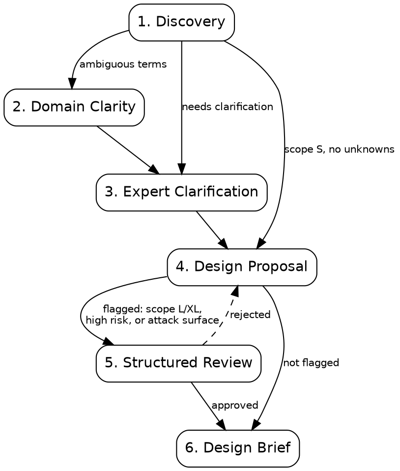

# brainstorming

Structured discovery to prevent rework. Always run for new features or ambiguous requirements.

Default subagent type for every dispatch below: `general-purpose`. Type is only called out where it differs.

## Process Flow

## Phase 1: Discovery

**action: Stakeholder Probe**
Identify the primary users and confirm via `AskUserQuestion`:

1. ✅ **Recommended** — [Audience] based on [feature context].
2. **Alternative** — [Secondary Audience] + reason for inclusion.
3. **Other** — Custom stakeholder.

4. **Codebase Scan:**
   - Read `references/codebase-scanner-prompt.md` before dispatching.
   - Dispatch the subagent with the prompt.
   - **Integration:** Extract "Interface Shapes," "Technical Constraints," "Analogous Features," and "Key Unknowns" from the result. Ground the Understanding Statement in these.
   - **Zero-Code Exit:** If the scan finds an existing feature or config that satisfies the request, present it and offer to exit.
5. **Understanding Statement:** Summarize findings, constraints, and Key Unknowns. Get user confirmation.
6. **Adaptive Routing:**
   - **Scope S + No Unknowns:** Skip to Phase 4.
   - **Scope XL:** Offer to split into sub-features.
   - **Ambiguous Terms:** Run Phase 2.
   - **Scope L/XL or High Blast Radius** (auth, payments, data deletion, external-facing API): Set the Phase 5 flag. Confirm it with the user before Phase 4.

## Phase 2: Domain Clarity (Term Definition)

**action: Define Term**
For each ambiguous term, propose a definition via `AskUserQuestion`:

1. ✅ **Recommended** — [Term]: [Definition] based on [codebase usage/patterns].
2. **Alternative** — [Term]: [Alternative Definition] + context.
3. **Other** — Custom definition.

- **Goal:** Resolve conflicts between code, docs, and team language.
- **Exit:** Document in `glossary.md` or `CONTEXT.md`.

## Phase 3: Expert Clarification (Techniques)

Select 1-2 techniques (max 4 questions total):

- **Why:** 5-Whys to find hidden motivation.
- **Premortem:** Imagine failure — what went wrong?
- **Success Logic:** Define success behavior without using "functional".
- **Anti-Scope:** Explicitly what we are NOT building.
- **Trust Breach:** How would an attacker abuse this? A concrete attack surface or sensitive data flow sets the Phase 5 flag.

## Creative Checkpoint (Before Design)

- Is there a zero-code solution (config, existing extension)?
- Did an analogous feature already solve this?
- What is the 10x simpler version?
- **Proactive Filter:** A zero-code or analogous solution found here becomes "Approach A" in Phase 4 — present it, do not silently drop it.

## Phase 4: Design Proposal

1. **Dispatch:** Spawn the subagent (`references/design-proposer-prompt.md`) with the compressed scan report and discovery findings.
2. **Present:** Offer 2-3 competing approaches with grounded tradeoffs.
3. **Approval Gate:** Wait for explicit commitment to one approach. Do not guess.
4. **Review Check:** Phase 5 flag set → run Phase 5 before the brief. Not set → skip to Phase 6.

## Phase 5: Structured Review (Conditional)

Runs only if the Phase 5 flag is set, or the user explicitly asks to "stress test" or "review" the design.

**Parallel Adversarial Loop:** Reviewers run concurrently for objectivity and lower latency.

1. **Dispatch Parallel Stress-Test:** Use `multi-agent-dispatch` to spawn three independent reviewers. Each sees only the design and context packet — none sees the others' objections or your internal reasoning.
   - **Skeptic** — assumes the design fails in production; surfaces weaknesses, edge cases, YAGNI violations.
   - **Constraint Guardian** — checks performance, scalability, security/privacy against the Codebase Context Report.
   - **User Advocate** — checks usability, cognitive load, error handling from the end user's view.
2. **Consolidate & Respond:**
   - Log every objection in a **Response Log** (Objection | Source | Severity | Designer Response | Resolution).
   - Resolve each row: **Accept & Revise** (update the design) or **Reject** (give a technical rationale). No row may stay open.
3. **Arbiter Gate:**
   - Dispatch the **Arbiter** with the original design, the revised design, and the full Response Log.
   - It judges whether rejections are valid and revisions actually mitigate the concerns.
   - Returns `APPROVED`, `REVISE` (back to step 2), or `REJECT` (back to Phase 4).
4. **Exit Gate:** All reviewers invoked, Response Log complete, Arbiter disposition `APPROVED`.

## Phase 6: Transition (Design Brief)

Produce mandatory `markdown-kv` brief:

- **Chosen Approach:** [Name + Letter]
- **Why:** [Key Tradeoff]
- **Scope:** [In-scope vs. Out-of-scope]
- **Success Criteria:** [Measurable outcomes / Acceptance Criteria]
- **Constraints:** [Stack, Timeline, Compliance, Technical Constraints]
- **Interface:** [Input/Output surface]
- **Architecture:** [Components + Responsibilities]
- **Risk Register:** [Risk/Likelihood/Mitigation table — pull rows from the Response Log if Phase 5 ran]
- **Review Disposition:** [Arbiter's APPROVED + date, or "Phase 5 not triggered"]
- **First Step:** [Single concrete action]

**next skills:**

- `planning`: To transform the design brief into a concrete implementation spec and task list.
- `architecting`: To refine boundaries or choose patterns if the design reveals structural complexity.

## Red Flags

- Skipping brainstorming because "it's obvious".
- Assumed terminology (e.g., Account vs. Customer).
- Capturing "HOW" (code) before "WHAT" (domain).
- **Self-Approval**: Approving a flagged design without the Arbiter.
- **Arbiter Rubber-stamping**: Arbiter approving with unresolved High-severity objections or rejections without rationale.
- **Context Drift**: Design ignores architectural constraints found in Phase 1.
- **Subagent Role Bleed**: Reviewers proposing redesigns instead of identifying flaws.
