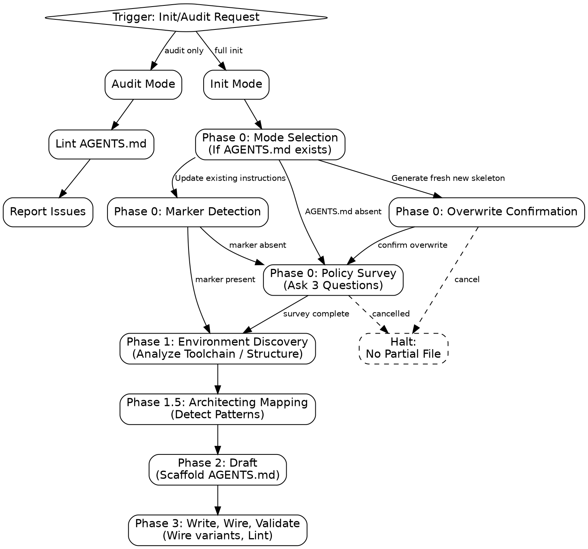

# codebase-init

**goal:** Maintain lean, high-signal `AGENTS.md`.
**constraint:** `CLAUDE.md`/`GEMINI.md` must be one-line redirect stubs to `AGENTS.md` (no duplicate contents).
**format:** Body style must be markdown-kv (`key: value` lines) — never prose paragraphs.
**target:** `AGENTS.md` < 100 lines.

## Process Flow



## Phase 0: Mode Selection & Hard Rule Survey

**constraint:** Check if root `AGENTS.md` exists before proceeding.

| Condition          | Action                                                                                                             |
| :----------------- | :----------------------------------------------------------------------------------------------------------------- |
| `AGENTS.md` absent | Proceed to **Policy Survey**                                                                                       |
| `AGENTS.md` exists | Call `AskUserQuestion` with options: "Update existing instructions (Recommended)" or "Generate fresh new skeleton" |

**Update/Overwrite Actions:**

- **selection:** "Generate fresh new skeleton"
  - **action:** Call `AskUserQuestion` to confirm: "Are you sure you want to overwrite the existing AGENTS.md file with a fresh skeleton?" ("Yes, overwrite" / "Cancel").
  - **constraint:** If user cancels, halt immediately. If user confirms, proceed to **Policy Survey**.
- **selection:** "Update existing instructions (Recommended)"
  - **action:** Scan `AGENTS.md` for `<!-- codebase-init:hard-rules v1 ... -->` matching exact `v1` schema (anchored on literal `v1`).
  - **action:** If marker found, bypass Policy Survey and proceed to **Phase 1**.
  - **action:** If marker absent/malformed, proceed to **Policy Survey**.

**Policy Survey Constraints:**

- **tool-call:** Call `AskUserQuestion` exactly once with all 3 questions (one question object per decision, in order).
- **options:** Never add an "Other" option manually (supplied automatically).
- **options-count:** Surface exactly 3 options per question.
- **cancellation:** Halt immediately if any prompt/question is cancelled/dismissed. No partial file must be written.
- **scope:** Monorepo package-level `AGENTS.md` overrides are never surveyed. Only root `AGENTS.md` triggers/skips survey.
- **preservation:** If root `AGENTS.md` lacks marker, all pre-existing sections must be preserved when regenerating.

**Survey Questions & Recommendations:**

1. **Commit & attribution policy:** `strict` / `relaxed` / `minimal`
   - _heuristic:_ Match git log commit-format match rate or `CONTRIBUTING.md` signal.
2. **Project maturity state:** `production` / `development`
   - _heuristic:_ Match version/tag, `CHANGELOG`, or release workflow signal.
3. **Testing rigor:** `always` / `touched-files` / `not-enforced`
   - _heuristic:_ Check if CI gates on the test suite.

**CI/CD Automation is never surveyed** — `scripts/run.py analyze-env` detects it directly from `.github/workflows/` / `.gitlab-ci.yml` (see `references/phase-1.5-architecting.md`), and `scaffold-agents-md` fills the marker's `ci=` value from that detection automatically. Override with `--ci <github-actions|gitlab-ci|local-only>` only if detection is wrong.

_Note:_ Read `references/hard-rules.md` for exact wording and heuristics.

## Phase 1: Environment Discovery

**command:**

```bash
python "$CLAUDE_PLUGIN_ROOT/skills/codebase-init/scripts/run.py" analyze-all . --max-depth 2
```

**env-resolution:** If `$CLAUDE_PLUGIN_ROOT` is undefined, fallback to the relative skill folder path (e.g., `skills/codebase-init`).
**action:** Runs `analyze-env`, `find-dependencies`, and `scan-structure`.

**manual-fallback:** If command fails, perform discovery manually:

1. **Toolchain:** Inspect `package.json`, `pyproject.toml`, `requirements.txt`, `go.mod`, etc. Do not hallucinate tools.
2. **Structure:** Use `ls -R` (limited depth) to identify core source directories.
3. **Workflows:** Inspect `.github/workflows/` or `.gitlab-ci.yml` for CI commands.

## Phase 1.5: Architecting Mapping

**action:** Read `references/phase-1.5-architecting.md` to select the `--language` value and detect tech stack patterns.

## Phase 2: Draft

**command:**

```bash
python "$CLAUDE_PLUGIN_ROOT/skills/codebase-init/scripts/run.py" scaffold-agents-md \
  --language <node|python|go|rust|java|dotnet|bun> \
  --purpose "<one sentence from Phase 1>" \
  --commit <strict|relaxed|minimal> \
  --maturity <production|development> \
  --testing <always|touched-files|not-enforced> \
  [--pm "<real pm from Phase 1>"] [--set key=value ...] \
  --out AGENTS.md
```

**mapping:**

- Strict / Relaxed / Minimal -> `strict` / `relaxed` / `minimal`
- Production / Development -> `production` / `development`
- Always required / Touched-files only / Not enforced -> `always` / `touched-files` / `not-enforced`

**manual-fallback:** If scaffolding command fails/fails to run due to environment issues, manually write/construct `AGENTS.md` following the required sections and markdown-kv format guidelines.

**post-generation actions:**

1. Fix incorrect Toolchain/Dependency/Command defaults.
2. Replace the Key Conventions TODO with 3-7 real `key: value` lines (see `references/guide.md` §2.5). Verify:
   - _Is this verifiable by reading code?_ (no vague "write clean code" guidelines)
   - _Is this a rule the linter could enforce instead?_ (linters enforce formatting/spacing; conventions should cover design patterns/architecture)
   - _Are we keeping conventions between 3 and 7 bullets?_

**required-sections:** Must follow this order top-to-bottom:

| Order | Section                  | Requirement                                                                               |
| :---- | :----------------------- | :---------------------------------------------------------------------------------------- |
| 1     | **H1 Header**            | `# Agent Instructions` or `# <Project> Agent Instructions`                                |
| 2     | **Description**          | Single KV: `purpose: <one sentence>`                                                      |
| 3     | **Hard Rules**           | Exactly 4 KV lines (`commit:`, `maturity:`, `testing:`, `ci:`) followed by marker comment |
| 4     | **Toolchain**            | Package manager and critical environment commands as KV lines                             |
| 5     | **File-Scoped Commands** | Table of file-targeted typecheck/lint/test commands                                       |
| 6     | **Conventions**          | 3-7 specific, actionable KV lines                                                         |
| 7     | **Attribution**          | `Co-Authored-By: <Model Name>` at the end of the file                                     |

## Phase 3: Write, Wire, Validate

**actions:**

1. Apply edits directly to `AGENTS.md` generated by Phase 2. Do not rewrite from scratch.
2. Run wiring script:
   ```bash
   python "$CLAUDE_PLUGIN_ROOT/skills/codebase-init/scripts/run.py" wire-agents AGENTS.md CLAUDE.md GEMINI.md
   ```
3. Run linting script:
   ```bash
   python "$CLAUDE_PLUGIN_ROOT/skills/codebase-init/scripts/run.py" lint-agents-md AGENTS.md
   ```
4. Fix all linting errors.

**manual-fallback:**

- If wiring script fails, manually wire `CLAUDE.md` and `GEMINI.md` as one-line redirect stubs containing exactly `# See [AGENTS.md](AGENTS.md)`.
- If linting script fails, ensure `AGENTS.md` has no prose/paragraphs in lists, uses markdown-kv format, is under 100 lines, contains no placeholder TODOs, and concludes with `Co-Authored-By: <Model Name>`.

**next-skills:**

- `architecting`: Map structural patterns, "God" modules, or circular dependencies.
- `brainstorming`: Explore new features.
- `planning`: Create concrete implementation plans.

## Audit Mode

**trigger:** User requests validation only (no regeneration).
**action:** Skip Phases 0/1/1.5/2.
**command:**

```bash
python "$CLAUDE_PLUGIN_ROOT/skills/codebase-init/scripts/run.py" lint-agents-md AGENTS.md
```

**constraint:** Do NOT read `references/hard-rules.md` or `references/phase-1.5-architecting.md` (prevents context wasting).

## Failure Recovery

**trigger:** Any step fails.
**action:** Halt execution immediately.
**action:** Invoke the `diagnose` skill (via the `Skill` tool) with script `stderr` and current `AGENTS.md`.
**constraint:** Do not apply manual fixes until `diagnose` confirms the root cause.
**resume:** After `diagnose` resolves the issue, resume at the failed phase (do not restart from Phase 0).

## Prohibitions

- **never:** Hallucinate tools or commands.
- **never:** Hand-write or copy the `AGENTS.md` skeleton. Always use `scaffold-agents-md`.
- **never:** Copy/symlink full content to `CLAUDE.md` or `GEMINI.md`. Must use one-line redirect stubs.
- **never:** Reorder `AGENTS.md` sections.
- **never:** Leave placeholder TODOs in the final file.
