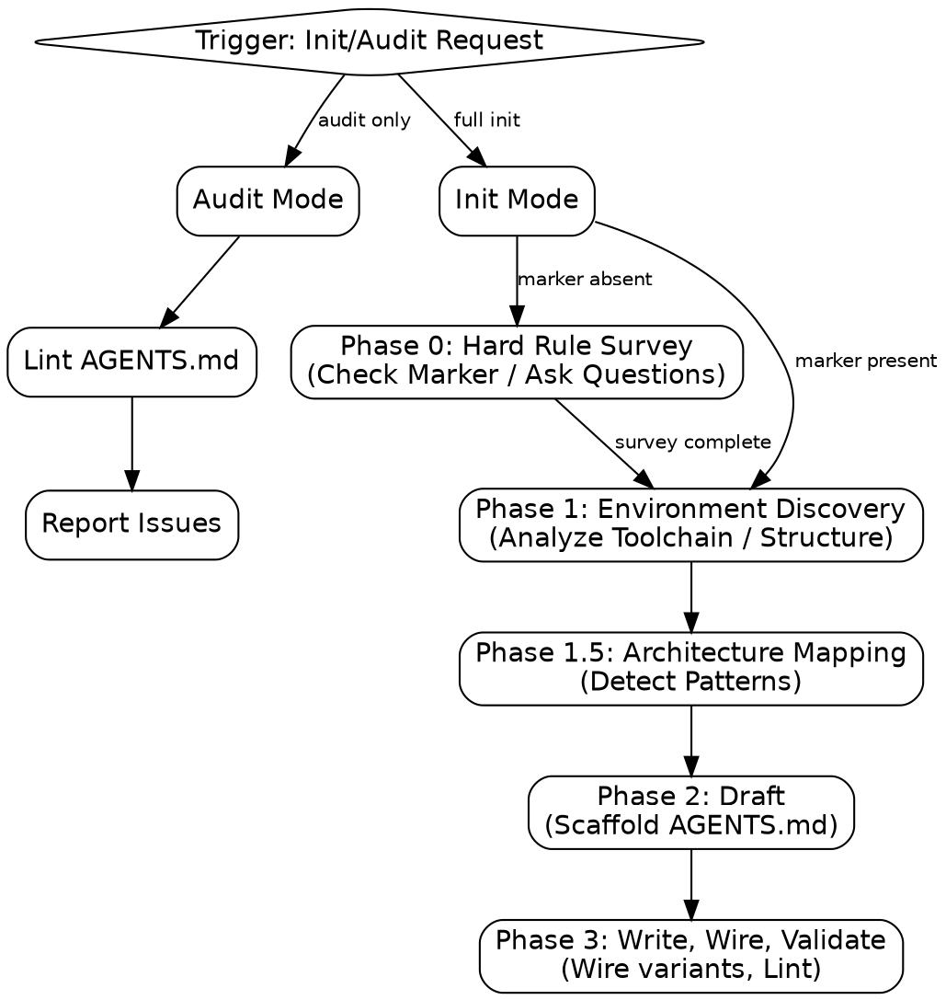

# codebase-init

Maintain lean, high-signal `AGENTS.md`. `CLAUDE.md`/`GEMINI.md` are one-line redirect stubs to it — never duplicates. Optimized for agent context injection, not human reading. Target: < 100 lines. Body style: markdown-kv (`key: value` lines), not prose paragraphs.

## Process Flow



## Phase 0: Hard Rule Survey

Before any analysis or drafting, determine whether the repo owner's policy decisions are already known.

**Marker-detection gate:** Check for an existing root `AGENTS.md`. If it contains a `<!-- codebase-init:hard-rules v1 ... -->` marker comment matching the exact `v1` schema (anchor on the literal `v1` token — do not match other versions or treat the schema as version-agnostic), the survey was already completed — skip straight to Phase 1. If the marker is absent (including the case where `AGENTS.md` doesn't exist at all, or exists but was hand-authored or generated by an earlier tool without a marker), proceed to ask the survey below.

**The survey:** Ask exactly 3 `AskUserQuestion` prompts, in this exact order, once per init:

1. Commit & attribution policy
2. Project maturity state
3. Testing rigor

Read `references/hard-rules.md` for the exact option wording and headers each prompt must use — do not invent or paraphrase the options inline here.

**Cancellation:** If the user cancels or dismisses any of the 3 prompts, halt immediately. Do not proceed to Phase 1 or draft any part of `AGENTS.md`. No partial file should be written.

**Monorepo scope:** Package-level `AGENTS.md` overrides are never surveyed independently — only the root `AGENTS.md` carries the `codebase-init:hard-rules` marker and triggers/skips this survey.

**Preservation rule:** If a pre-existing root `AGENTS.md` lacks the marker, it still must go through the survey, but all of its other existing sections (whatever their origin) must be preserved, not discarded, when the file is regenerated.

## Phase 1: Environment Discovery

Run all analysis subcommands to ground instructions in project reality:

```bash
python "$CLAUDE_PLUGIN_ROOT/skills/codebase-init/scripts/run.py" analyze-all . --max-depth 2
```

This sequentially runs `analyze-env` (package manager, test runner, linter, monorepo structure), `find-dependencies` (installed dependency directories), and `scan-structure` (directory tree, respecting `.gitignore`).

**Manual Fallback:** If the script fails, you MUST manually perform the discovery:

1. **Toolchain**: Inspect `package.json` (Node), `pyproject.toml`/`requirements.txt` (Python), `go.mod` (Go), etc., to identify the package manager, test runner, and linter.
2. **Structure**: Use `ls -R` (limited depth) to map the directory tree and identify core source folders.
3. **Workflows**: Check `.github/workflows/` or `.gitlab-ci.yml` for automated CI commands.
   Never hallucinate tools.

## Phase 1.5: Architecture Mapping

Read `references/phase-1.5-architecture.md` to pick the `--language` value for Phase 2 and detect tech stack patterns.

## Phase 2: Draft

Generate the skeleton — don't hand-write or hand-copy one. Run:

```bash
python "$CLAUDE_PLUGIN_ROOT/skills/codebase-init/scripts/run.py" scaffold-agents-md \
  --language <node|python|go|rust|java|dotnet|bun> \
  --purpose "<one sentence from Phase 1>" \
  --commit <strict|relaxed|minimal> \
  --maturity <production|development> \
  --testing <always|touched-files|not-enforced> \
  [--pm "<real pm from Phase 1>"] [--set key=value ...] \
  --out AGENTS.md
```

`--commit`/`--maturity`/`--testing` are the marker tokens, not the Phase 0 question labels — map: Strict/Relaxed/Minimal → `strict`/`relaxed`/`minimal`; Production/Development → `production`/`development`; Always required/Touched-files only/Not enforced → `always`/`touched-files`/`not-enforced` (see `references/hard-rules.md`). Use `--pm`/`--set key=value` to override any default with what Phase 1 actually found (e.g. `--set test='npm test'`) — never leave a wrong default in place. No language match? Read `references/guide.md` §1 for the manual fallback (monorepo/polyglot/package-override patterns, or picking the closest `--language` and overriding everything).

This writes a complete skeleton with Hard Rules first, the marker, and a `## Key Conventions` TODO placeholder. Now, grounded only in Phase 1/1.5 output — never invented:

1. Fix any remaining wrong Toolchain/Dependency/Command default.
2. Replace the Key Conventions TODO with 3-7 real `key: value` lines (see `references/guide.md` §2.5 for the good/bad checklist).

Every drafted `AGENTS.md` must satisfy the Required Sections below, in order — the scaffold already produces this order; don't reorder it by hand.

### Required Sections (top-to-bottom order)

| Order | Section                  | Requirement                                                                                                                                   |
| ----: | :----------------------- | :-------------------------------------------------------------------------------------------------------------------------------------------- |
|     1 | **H1 Header**            | `# Agent Instructions` or `# <Project> Agent Instructions`                                                                                    |
|     2 | **Description**          | Single `kv` line: `purpose: <one sentence>`.                                                                                                  |
|     3 | **Hard Rules**           | Exactly 3 `kv` lines — `commit:`, `maturity:`, `testing:` — derived from the Phase 0 survey, followed by the hard-rules marker comment above. |
|     4 | **Toolchain**            | Package manager and critical environment commands, as `kv` lines.                                                                             |
|     5 | **File-Scoped Commands** | Table of file-targeted typecheck/lint/test commands.                                                                                          |
|     6 | **Conventions**          | 3-7 specific, actionable `kv` lines (e.g., `errors: extend AppError, never throw raw Error`).                                                 |
|     7 | **Attribution**          | `Co-Authored-By: <Model Name>` at end of file.                                                                                                |

## Phase 3: Write, Wire, Validate

1. `AGENTS.md` is already on disk from Phase 2's `--out AGENTS.md`. Apply the Toolchain/Conventions edits from Phase 2 directly to that file — don't rewrite it from scratch.
2. Run `python "$CLAUDE_PLUGIN_ROOT/skills/codebase-init/scripts/run.py" wire-agents AGENTS.md CLAUDE.md GEMINI.md` to write one-line redirect stubs (`# See [AGENTS.md](AGENTS.md)`) into the variant filenames. Never copy/symlink full content into them — that wastes tokens on every load.
3. Run `python "$CLAUDE_PLUGIN_ROOT/skills/codebase-init/scripts/run.py" lint-agents-md AGENTS.md` and fix any FAIL-level issues before finishing. If a `PostToolUse` hook already runs `scripts/run_lint.sh` on save, this step is redundant but harmless.

## Audit Mode

If the user only wants to validate an existing `AGENTS.md` (no regeneration), skip Phases 0/1/1.5/2 entirely: run `python "$CLAUDE_PLUGIN_ROOT/skills/codebase-init/scripts/run.py" lint-agents-md AGENTS.md` and report the issues found.

## Failure Recovery

If any analysis script, scaffold command, or wiring step fails:

1. Stop execution.
2. Invoke `diagnose` with the script's `stderr` and the current state of `AGENTS.md`.
3. Do not attempt manual fixes until `diagnose` confirms the root cause (e.g., missing dependencies, wrong Python version).

## NEVER

- **NEVER** hallucinate tools or commands: Only document what is actually present in the project.
- **NEVER** hand-write or hand-copy the `AGENTS.md` skeleton: Always use the `scaffold-agents-md` command to ensure correct schema and marker placement.
- **NEVER** copy/symlink full content into `CLAUDE.md`/`GEMINI.md`: These must be one-line redirect stubs to save token context.
- **NEVER** reorder the `AGENTS.md` sections by hand: Maintain the standard order for consistency across agents.
- **NEVER** leave placeholder TODOs in the final file: Every convention and command must be grounded in reality.
