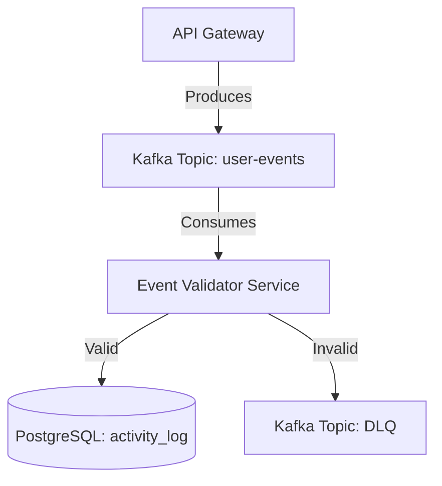

# Domain-Specific Spec Examples

This file contains fully-worked spec examples for common domains. Reference these when writing specs for similar systems.

---

## Example 1: REST API Specification

**Domain**: Backend API for an order management system

### Specification: Order Creation API

#### Goal

Enable external systems to create orders programmatically via an authenticated API endpoint. Completion signal: external client can submit a POST request with order data and receive a unique orderId.

#### Requirements (Order Creation API)

- `REQ-001`: The API MUST accept POST requests to `/api/v1/orders` with a JSON payload.
- `REQ-002`: The API MUST validate that all required fields are present and reject invalid requests with a 400 error.
- `REQ-003`: The API MUST return a unique, non-guessable `orderId` in the response.
- `REQ-004`: The API MUST idempotently handle duplicate requests (same body within 60 seconds = return same orderId).
- `SEC-001`: All requests MUST include a valid Bearer token in the Authorization header.
- `SEC-002`: Requests without a valid token MUST return 401 Unauthorized.
- `PERF-001`: The API MUST respond within 500ms under normal load (100 concurrent requests).

#### Constraints

- `CON-001`: The API MUST NOT create new database tables; it MUST use existing `orders` and `order_items` tables.
- `CON-002`: The response payload MUST NOT exceed 10 KB.
- `CON-003`: The system MUST NOT support order creation via GET requests (POST only).
- `CON-004`: Inventory MUST NOT be decremented until the order status transitions to "confirmed".

#### Interfaces

##### POST /api/v1/orders

**Input**: JSON object

- `customerId` (string, UUID, required): Unique customer identifier
- `items` (array, required): List of items, each with:
  - `productId` (string, required): Product identifier
  - `quantity` (integer, required): Quantity >= 1
- `shippingAddress` (object, optional): Delivery address
  - `street`, `city`, `zip`, `country` (all strings, all required if address is provided)

**Output**: JSON object

- `orderId` (string): Unique order identifier (e.g., "ORD-20260518-ABC123")
- `status` (string): Always "pending" for new orders
- `createdAt` (ISO 8601 timestamp): Timestamp of creation
- `totalPrice` (number): Total cost in USD

**Errors**:

- `400 Bad Request`: Missing required fields, invalid JSON, quantity <= 0, or invalid customerId format
- `401 Unauthorized`: Missing or invalid Bearer token
- `409 Conflict`: CustomerId does not exist in database
- `503 Service Unavailable`: Downstream inventory service unavailable (timeout >5s)

#### Context

- **Existing files**: Order creation logic exists in `src/services/orderService.ts`; authentication middleware in `src/middleware/auth.ts`
- **Current behavior**: Orders are created synchronously via internal function calls; no public API yet
- **Conventions**: API versioning via `/api/v1/`; ISO 8601 timestamps; HTTP status codes per RFC 7231
- **Platform**: Node.js + Express; database is PostgreSQL with `orders` table; Bearer tokens are JWT

#### Acceptance Criteria & Validation

**Acceptance Criteria**:

- `AC-001`: External client can submit a valid order request and receive a 200 response with orderId and createdAt.
- `AC-002`: Invalid requests (missing customerId, quantity <= 0) return 400 with descriptive error message.
- `AC-003`: Requests without Authorization header return 401.
- `AC-004`: Duplicate requests (same body, submitted within 60 seconds) return the same orderId.

**Validation Steps**:

- `VAL-001`: Run test suite: `npm test -- src/routes/orders.test.ts` (expect 0 failures)
- `VAL-002`: Manual smoke test: submit valid request via `curl`; verify response includes orderId
- `VAL-003`: Load test with Apache JMeter: 100 concurrent requests; verify 99th percentile latency < 500ms
- `VAL-004`: Submit request without Authorization header; confirm 401 response

#### Examples & Edge Cases

**Positive Example**:

```http
Request:
POST /api/v1/orders
Authorization: Bearer eyJhbGc...
Content-Type: application/json

{
  "customerId": "cust-5f8a9c1d",
  "items": [
    { "productId": "prod-22", "quantity": 2 },
    { "productId": "prod-45", "quantity": 1 }
  ],
  "shippingAddress": {
    "street": "123 Main St",
    "city": "Portland",
    "zip": "97201",
    "country": "US"
  }
}

Response (200 OK):
{
  "orderId": "ORD-20260518-ABC123",
  "status": "pending",
  "createdAt": "2026-05-18T14:30:00Z",
  "totalPrice": 129.99
}
```

**Edge Cases**:

- Empty items array → 400 Bad Request ("items must contain at least 1 product")
- Quantity of 0 → 400 Bad Request ("quantity must be >= 1")
- CustomerId that doesn't exist in database → 409 Conflict ("customer not found")
- Downstream service timeout → 503 Service Unavailable (after 5s wait)
- Duplicate request: submit same body twice within 60s → both return same orderId
- Extremely large payload (>10KB) → 413 Payload Too Large

#### Notes & Risks

- `RISK-001`: Idempotency key is based on request body hash; if clients send slightly different formatting (e.g., whitespace), they'll be treated as new requests. Consider implementing an `idempotencyKey` header instead.
- `NOTE-001`: Current inventory service has a 5s timeout; if this API becomes high-volume, consider async inventory decrement (order first, decrement asynchronously).
- `NOTE-002`: No audit logging yet; consider adding for compliance (e.g., HIPAA, PCI-DSS).

---

## Example 2: Database Schema Specification

**Domain**: SQL schema for a user authentication system

### Specification: User Authentication Schema

#### Goal

Define a PostgreSQL schema to store user accounts, credentials, and sessions for JWT-based authentication. Completion signal: application can create users, store hashed passwords, and validate tokens.

#### Requirements

- `REQ-001`: The system MUST store user email addresses and hashed passwords securely.
- `REQ-002`: The system MUST store JWT refresh tokens and their expiration times.
- `REQ-003`: Emails MUST be unique across all users (enforce via UNIQUE constraint).
- `SEC-001`: Passwords MUST be hashed using bcrypt with cost factor >= 12.
- `SEC-002`: Refresh tokens MUST NOT be stored in plaintext; store hash only.
- `COMP-001`: Schema MUST be compatible with existing PostgreSQL 13+ databases.

#### Constraints (Authentication Schema)

- `CON-001`: MUST NOT store plaintext passwords.
- `CON-002`: MUST NOT modify existing `orders` or `products` tables.
- `CON-003`: Refresh tokens MUST expire and be pruned after 7 days.

#### Interfaces (Authentication Schema)

##### users table

| Column          | Type         | Constraints                            | Purpose                          |
| --------------- | ------------ | -------------------------------------- | -------------------------------- |
| `id`            | UUID         | PRIMARY KEY, DEFAULT gen_random_uuid() | User identifier                  |
| `email`         | VARCHAR(255) | UNIQUE, NOT NULL                       | Email address (login identifier) |
| `password_hash` | VARCHAR(255) | NOT NULL                               | bcrypt hash of password          |
| `created_at`    | TIMESTAMP    | NOT NULL, DEFAULT CURRENT_TIMESTAMP    | Account creation time            |
| `updated_at`    | TIMESTAMP    | NOT NULL, DEFAULT CURRENT_TIMESTAMP    | Last modification time           |

##### refresh_tokens table

| Column       | Type         | Constraints                            | Purpose                    |
| ------------ | ------------ | -------------------------------------- | -------------------------- |
| `id`         | UUID         | PRIMARY KEY, DEFAULT gen_random_uuid() | Token record identifier    |
| `user_id`    | UUID         | NOT NULL, FOREIGN KEY(users.id)        | User this token belongs to |
| `token_hash` | VARCHAR(255) | NOT NULL, UNIQUE                       | Hash of the refresh token  |
| `expires_at` | TIMESTAMP    | NOT NULL                               | Expiration time (UTC)      |
| `created_at` | TIMESTAMP    | NOT NULL, DEFAULT CURRENT_TIMESTAMP    | When token was issued      |

#### Context

- **Existing database**: PostgreSQL 13 with `orders` and `products` tables
- **Current behavior**: No authentication yet; planning to add JWT
- **Platform**: Node.js with Sequelize ORM; migrations stored in `db/migrations/`

#### Acceptance Criteria & Validation

- `AC-001`: Users can be created with email + password; password is stored as bcrypt hash
- `AC-002`: Refresh tokens can be issued and validated; expired tokens are rejected

**Validation Steps**:

- `VAL-001`: Run database migrations: `npm run migrate`; confirm tables created
- `VAL-002`: Insert test user; verify password is hashed (not plaintext) in database
- `VAL-003`: Query refresh_tokens; verify token_hash is not plaintext

#### Examples & Edge Cases

- Valid password "MyP@ssw0rd!" → bcrypt hash "$2b$12$..." stored
- Very long email (255 chars) → accepted and stored
- Duplicate email → INSERT fails (UNIQUE constraint violation)
- Expired token (expires_at < NOW()) → application rejects during validation

#### Notes & Risks

- `RISK-001`: Bcrypt cost factor >= 12 is computationally expensive (~100ms per hash); consider performance impact on user signup
- `NOTE-001`: Plan to add `email_verified` column in future for two-factor auth

---

## Example 3: CLI Tool Specification

**Domain**: Command-line tool for managing database migrations

### Specification: Migration CLI

#### Goal

Enable developers to manage database schema migrations from the command line with version control. Completion signal: users can create, apply, and rollback migrations.

#### Requirements

- `REQ-001`: MUST support `migrate create <name>` to generate a new migration file.
- `REQ-002`: MUST support `migrate up` to apply pending migrations in order.
- `REQ-003`: MUST support `migrate down` to rollback the last applied migration.
- `REQ-004`: MUST track applied migrations in a `migrations` table in the database.
- `REQ-005`: MUST validate that migration files contain valid SQL before executing.

#### Constraints

- `CON-001`: MUST NOT modify migrations that have already been applied.
- `CON-002`: MUST NOT allow out-of-order migration execution.
- `CON-003`: MUST NOT rollback across multiple versions in one command (one at a time).

#### Interfaces

##### migrate create [name]

**Input**: Positional argument `name` (required, alphanumeric + hyphens)
**Output**: Creates file `migrations/<timestamp>-<name>.sql` with template content
**Example**: `migrate create add-user-email-column` → creates `migrations/20260518144530-add-user-email-column.sql`

##### migrate up

**Input**: None (reads from `migrations/` directory)
**Output**: Applies all unapplied migrations in order; logs each step
**Example**: Applies 2 pending migrations; outputs "Applied 2-001.sql" and "Applied 2-002.sql"

##### migrate down

**Input**: None
**Output**: Rolls back the most recently applied migration; logs the action
**Example**: Reverts last migration; outputs "Rolled back 2-002.sql"

#### Context

- **Files**: CLI code in `src/cli/migrate.ts`; migrations stored in `migrations/` directory
- **Database**: PostgreSQL with `schema_migrations` table tracking applied migrations
- **Conventions**: Migration filenames: `<timestamp>-<name>.sql`

#### Acceptance Criteria & Validation

- `AC-001`: User can create a migration; file appears in `migrations/` directory
- `AC-002`: User can apply migrations; database reflects changes and migrations table updates
- `AC-003`: User can roll back; database reverts to previous state

#### Examples & Edge Cases

- Valid migration: `CREATE TABLE users (id UUID PRIMARY KEY);` → applied successfully
- Invalid migration: `SELEC * FROM users;` (typo) → validation fails; user notified
- Rollback with no applied migrations → error: "Nothing to rollback"
- Migration file with comments → parsed and executed correctly

---

## Example 4: Blueprint Specification (Distributed System)

**Domain**: High-throughput event processing pipeline

### Specification: User Activity Event Pipeline

#### Goal

Ingest, validate, and store high-volume user activity events for real-time analytics. Completion signal: events submitted to the API Gateway are durably stored in the `activity_log` table within 2 seconds.

#### Requirements

- `REQ-001`: The system MUST consume events from the `user-events` Kafka topic.
- `REQ-002`: The system MUST validate event payloads against the UserActivity JSON Schema.
- `REQ-003`: The system MUST write valid events to the PostgreSQL `activity_log` table.
- `REQ-004`: The system MUST route invalid events to the `user-events-dlq` (Dead Letter Queue) topic.
- `PERF-001`: The system MUST process at least 5,000 events per second per consumer instance.
- `COMP-001`: The system MUST integrate with the existing Confluent Cloud Kafka cluster.

#### Constraints

- `CON-001`: The system MUST NOT drop invalid events silently; they MUST go to the DLQ.
- `CON-002`: The system MUST NOT perform inline data enrichment (external API calls) during consumption.

#### Interfaces

##### Kafka Topic: `user-events` (Input)

**Input**: JSON payload (value)

- `eventId` (string, UUID, required)
- `userId` (string, required)
- `eventType` (string, enum: "click", "view", "purchase", required)
- `timestamp` (integer, epoch milliseconds, required)

##### PostgreSQL Table: `activity_log` (Output: Valid)

**Output**: Row insertion

- `id` (UUID, primary key)
- `user_id` (VARCHAR)
- `event_type` (VARCHAR)
- `occurred_at` (TIMESTAMP)

##### Kafka Topic: `user-events-dlq` (Output: Invalid)

**Output**: JSON payload (value)

- `originalPayload` (string, raw JSON)
- `validationError` (string, reason for failure)

#### Context

- **Existing Architecture**: Client apps send events to an API Gateway, which produces them to Kafka.
- **Platform**: Node.js microservice using `kafkajs` and `pg`.
- **Conventions**: At-least-once delivery semantics; idempotent database writes using `ON CONFLICT (id) DO NOTHING`.

#### Acceptance Criteria & Validation

- `AC-001`: Valid events published to the topic appear in the database.
- `AC-002`: Invalid events (missing `eventType`) are routed to the DLQ and do not crash the consumer.

**Validation Steps**:

- `VAL-001`: Produce 1,000 valid events via Kafka CLI; verify `COUNT(*)` in `activity_log` increases by 1,000.
- `VAL-002`: Produce an event with a malformed JSON payload; verify it appears in the DLQ topic with the parsing error.

#### Examples & Edge Cases

- **Valid Event**: `{ "eventId": "uuid-1", "userId": "user-42", "eventType": "click", "timestamp": 1716040000000 }` → Inserted to DB.
- **Malformed JSON**: `{ "eventId": "uuid-1",` → Sent to DLQ.
- **Missing Required Field**: Valid JSON, but no `userId` → Sent to DLQ.
- **Duplicate Event**: Same `eventId` consumed twice → First inserted, second ignored (idempotent).
- **Database Unavailable**: Consumer MUST pause fetching and retry with exponential backoff.

#### Notes & Risks

- `RISK-001`: Data loss during broker partition rebalancing if offsets are committed before database writes complete. MUST commit offsets only *after* successful DB insert or DLQ publish.
- `ROLLBACK`: If the error rate (DLQ publish rate) exceeds 1% within 5 minutes of deployment, revert the deployment and replay failed events from the DLQ.
- `MIGRATION`:
  1. Deploy new consumer group alongside old (if applicable).
  2. Monitor offset lag to ensure consumers keep up with throughput.

**Architecture Diagram**:



---

## Template for Your Own Domain

Use this outline for specs you write:

```markdown
# Specification: [Title]

## 1. Goal

[One sentence outcome] + [measurable completion signal]

## 2. Requirements

- REQ-###: [singular, testable obligation]
- SEC-###, PERF-###, COMP-### as needed

## 3. Constraints

- CON-###: [explicit limit or non-goal]

## 4. Interfaces

- For each endpoint/table/command: name, input, output, errors

## 5. Context

- Existing code, conventions, platform

## 6. Acceptance Criteria & Validation

- AC-###: [observable completion signal]
- VAL-###: [verification step + expected result]

## 7. Examples & Edge Cases

- Positive example with input/output
- 3–4 edge cases and how to handle them

## 8. Notes & Risks (Optional)

- Implementation concerns, future work, rollout notes
```
