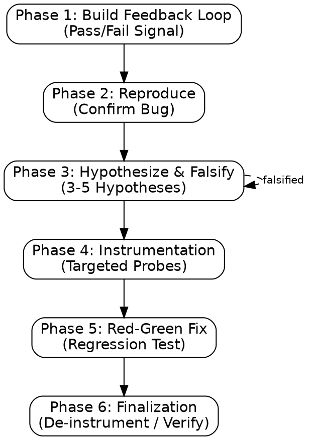

# diagnose

Identify true root cause through systematic falsification. **DO NOT GUESS.**

## Process Flow



**trigger:** debug, fix crash, unexpected behavior.
**constraint:** never apply multiple changes simultaneously. One hypothesis per run.
**constraint:** never modify original source directly. Use working copy.
**constraint:** never accept "works on my machine" as root cause.

## Phase 1: Build Feedback Loop

**action:** Create deterministic < 2s pass/fail signal.
**action:** Isolate filesystem, pin seeds/time.
**gate:** If no code execution, request logs/telemetry. Do not proceed without loop.

## Phase 2: Reproduce

**action:** Achieve >50% reproduction rate before hypothesis testing.

## Phase 3: Hypothesize & Falsify

**action: Present Hypotheses**
Read `references/phases.md` and propose 3-5 falsifiable hypotheses via `AskUserQuestion`:

1. ✅ **Recommended** — [Primary Hypothesis] based on [Recent Changes > Logic > Env].
2. **Alternative** — [Plausible Option] + condition for testing.
3. **Other** — Custom hypothesis.

**format:** "If [X] is the cause, then [Y] will change when I do [Z]."
**dispatch:** If hypotheses are independent, use `multi-agent-dispatch`. Each hypothesis agent must be a **Writer with `isolation: worktree`** (not the read-only Investigator role) — instrumenting and running an experiment mutates a working copy, so each agent needs its own worktree. Disjoint by construction since each agent tests a different hypothesis.

## Phase 4: Instrumentation

**action:** Instrument code dynamically at decision boundaries.
**format:** Prefix debug logs with `[DEBUG-XXXX]`.
**constraint:** Never "log everything." Use profilers (`time.perf_counter`) for perf issues.

## Phase 5: Red-Green Fix

**action:** Write regression test targeting failing seam **before** fix.
**action:** Confirm RED (test fails).
**action:** Apply minimal fix on working copy.
**action:** Confirm GREEN (test passes).

## Phase 6: Finalization

**action:** Remove all `[DEBUG-XXXX]` tags.
**action:** Verify fix via Phase 1 loop.
**action:** Delete throwaway scripts or promote to test suite.

**next skills:**

- `test-driven-development`: To implement the verified fix if it involves new logic or refactoring.
- `refactor`: If the diagnosis reveals a structural "mess" that needs cleanup after the fix is verified.
- `planning`: If the bug reveals a major gap in the original specification or architecture.

## Transition

| Triggering Skill                 | Return Destination      |
| :------------------------------- | :---------------------- |
| `verification-before-completion` | Re-verify in same skill |
| `test-driven-development`        | Current task/phase      |
| `multi-agent-development`        | Current task/phase      |
| `refactor`                       | Resume refactor cycle   |

## Output Format

```markdown
## Diagnosis Summary

**symptom:** [Description]
**root_cause:** [Correct Hypothesis]
**fix:** [Changes]
**feedback_loop:** [Reproduction Script]

## Post-Mortem

**prevention:** [Architecture/Test improvement]
**next_steps:** [Follow-up tasks]
```
