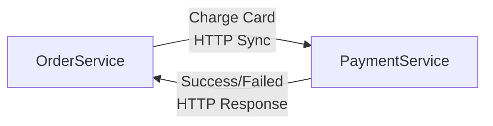

# Diagrams Skill: Quick Reference Guide

## How to Use (The Right Way)

### 1️⃣ The Skill Will Ask Clarifying Questions

Before drawing, expect:
- "How many components total?" (if not stated, to detect >20 nodes)
- "Are these sync-first or async-first?" (to route correctly)
- "Do you need to show failure paths?" (to plan diagram complexity)

**This is normal and helpful.** Answer clearly to get the right diagram.

---

## 2️⃣ The NEVER List (These Will Be Rejected)

| Don't Do | Why | Alternative |
|----------|-----|-------------|
| `OrderService <--> PaymentService` | Hides coupling | Split into two arrows: `→` and `←` |
| "Draw all 30 services in one diagram" | Visual spaghetti | Create L1 Context + L2 Components |
| "Services communicate" (ambiguous) | Unclear if sync/async | Ask clarifying question first |
| "Checkout process [with ERD]" | Wrong question type | Use sequence diagram for flow |
| `[FAILED]` (red box only) | Colorblind users can't read | Add text label + optional color |

---

## 3️⃣ Diagram Type Selection Guide

**Choose based on your question:**

| Your Question | Use This | File |
|---|---|---|
| "How do services interact? Who calls whom?" | **Sequence Diagram** | sequence-diagrams.md |
| "What are the system boundaries and components?" | **C4 Diagram** | c4-diagrams.md |
| "How should data be structured?" | **ERD** | erd-diagrams.md |
| "What's the domain model? Entities and value objects?" | **Class Diagram** | class-diagrams.md |
| "What's the process flow? Decision tree?" | **Flowchart** | flowcharts.md |
| "How does state change? Events and conditions?" | **State Machine** | flowcharts.md |

---

## 4️⃣ Common Patterns (Copy-Paste Ready)

### Saga with Compensation
📄 See: `examples/saga-compensation-pattern.mmd`
- For: Multi-service transactions with failure handling
- Shows: OrderService + PaymentService + InventoryService with refunds

### God Diagram Splitting
📄 See: `examples/god-diagram-split-example.mmd`
- For: Systems with >20 components
- Shows: L1 Context (simple) + L2 Components (detailed)

### Bi-Directional Decomposition
📄 See: `examples/bidir-decomposition-example.mmd`
- For: When you want to draw `A <--> B`
- Shows: Why it's bad + 2 solutions

### DDD Bounded Contexts
📄 See: `examples/ddd-bounded-contexts-example.mmd`
- For: Multi-domain systems with aggregates
- Shows: 4 bounded contexts with entities, value objects, domain events

### Swimlane Flowchart
📄 See: `examples/swimlane-flowchart-example.mmd`
- For: Multi-actor processes (Customer + Order Service + Payment Service)
- Shows: Who does what, in sequence, across boundaries

---

## 5️⃣ Async vs Sync: How to Model

### Synchronous Call (Blocking)
Used for: "A needs immediate response from B"



### Asynchronous Call (Non-Blocking)
Used for: "A publishes, B consumes independently"


**Key**: Queue is EXPLICIT participant, not direct arrow.

---

## 6️⃣ When to Split into Multiple Diagrams

| Situation | Action |
|-----------|--------|
| >20 components | Split into L1 Context + L2 Components |
| Multiple bounded contexts | Create separate class diagrams per context |
| Complex flow with many paths | Use sequence diagram for behavior, ERD for data |
| Multi-actor process | Use swimlane flowchart |

---

## 7️⃣ Validation

Every diagram you get will be:
1. ✅ **Syntax-checked** — `lint_diagram.js` runs on it
2. ✅ **Anti-pattern free** — No bi-directional arrows, no god diagrams
3. ✅ **Readable** — Line crossings minimized, clear participant ordering

If validation fails, the skill will fix it before showing you.

---

## 8️⃣ When to Use Multiple Diagrams (Not Split)

### Sequence + ERD
- **Sequence**: Shows HOW the checkout process works (temporal flow)
- **ERD**: Shows HOW the data is structured (relationships)
- **Use both**: Sequence for behavior, ERD for data model

### C4 Context + Component
- **Context (L1)**: Shows system boundaries and external integrations
- **Component (L2)**: Shows internal microservices and dependencies
- **Use both**: Context for stakeholders, Component for technical team

### Flowchart + State Machine
- **Flowchart**: Shows algorithmic logic (if X then do Y)
- **State Machine**: Shows lifecycle (states + transitions + conditions)
- **Use both**: Flow for processes, State Machine for entity lifecycle

---

## 9️⃣ FAQ

**Q: Can I have bi-directional arrows?**
A: No. They hide coupling. Use two arrows instead: `→` and `←`.

**Q: Can I draw all 25 services in one diagram?**
A: No. Create L1 Context (simple) + L2 Components (detailed) instead.

**Q: What if I'm not sure if it's sync or async?**
A: Ask the skill. It will clarify before routing.

**Q: Can I show colors for status?**
A: Yes, but also add text labels like `[FAILED]` for accessibility.

**Q: Where are the examples?**
A: In `examples/` directory. Five ready-to-use patterns.

**Q: What if my diagram is too complex?**
A: It's probably a god diagram. Skill will help you split it.

---

## 🔟 Contact & Support

- **Reference files**: `references/` directory
- **Examples**: `examples/` directory
- **Anti-pattern explanations**: `references/faq-antipatterns.md`
- **Full guide**: `IMPROVEMENTS_SUMMARY.md`

---

## Cheat Sheet

```
>20 components?           → Split into L1 + L2
Bi-directional arrows?    → Reject, use two arrows
Ambiguous sync/async?     → Ask clarifying question
Wrong diagram type?       → Route to correct reference
Needs failure paths?      → Use alt blocks in sequence
Multi-actor process?      → Use swimlanes in flowchart
Polymorphic relation?     → See erd-diagrams.md patterns
Bounded contexts?         → See class-diagrams.md DDD patterns
```

**Most important**: The skill will guide you. Trust the clarifying questions!
