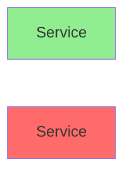
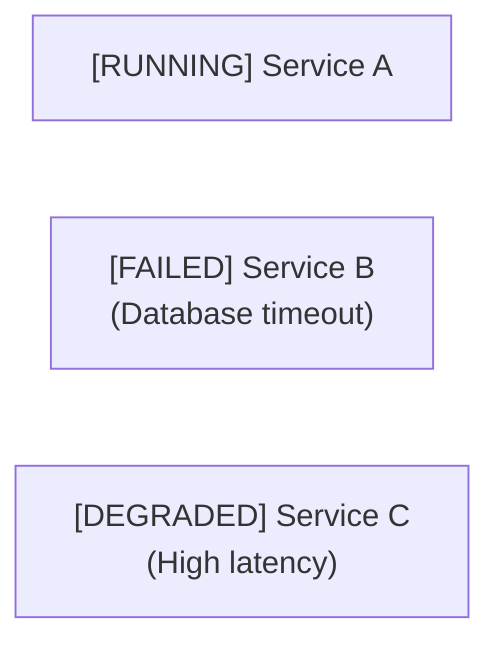
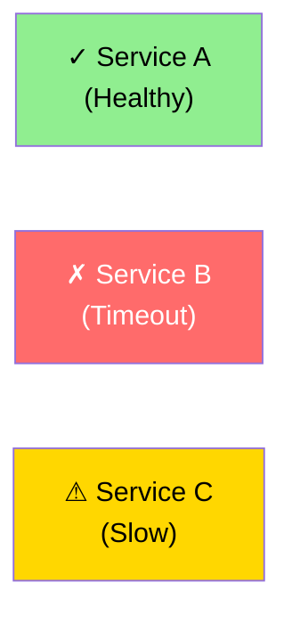

# FAQ: Why Anti-Patterns Matter

This reference explains the reasoning behind each NEVER item. Share these explanations with users when rejecting anti-patterns.

---

## Why NOT Bi-Directional Arrows?

**The Problem**:
```
OrderService <--> PaymentService
```
This diagram suggests both services call each other. In reality, this almost never happens without creating tight coupling and race conditions.

**What Actually Happens**:
1. OrderService initiates a charge: `OrderService → PaymentService (sync HTTP call)`
2. PaymentService responds with success/failure: `(implicit return in same HTTP call)`
3. Later, PaymentService might notify OrderService of a reversal: `PaymentService → OrderService (async webhook callback)`

**Why This Matters**:
- **Coupling**: If both services call each other, they're tightly coupled. Changes to either service can break the other.
- **Race Conditions**: Bidirectional communication can create circular dependencies and timing issues.
- **Confusion**: Readers can't tell which direction is blocking and which is async.

**The Fix**:
```
Option 1: Two separate arrows (preferred for C4/component diagrams)
  OrderService →→ PaymentService (sync charge)
  PaymentService -.→ OrderService (async webhook, later)

Option 2: Sequence diagram (preferred for understanding flow)
  OrderService → PaymentService: ChargeCard
  PaymentService → OrderService: ChargeAccepted (in HTTP response)
  [Later, async:]
  PaymentService → OrderService: PaymentProcessed (webhook)

Option 3: Abstract to higher level (if details are hidden)
  Application ↔ Payment Gateway (message broker hides details)
```

---

## Why NOT God Diagrams (>20 Nodes)?

**The Problem**:
A diagram with 25 microservices, 10 databases, 5 queues, and 20 external integrations all on one page.

**Why This Matters**:
- **Visual Spaghetti**: Lines cross everywhere, readers get lost trying to follow a flow.
- **Scale Overload**: Human working memory can hold ~5-7 items at once. 25+ items exceed cognitive load.
- **Communication Failure**: The whole point of a diagram is to communicate. An unreadable diagram communicates nothing.
- **No Hierarchy**: A god diagram treats all components equally. Important relationships get lost in the noise.

**The Fix**:
Create a **hierarchical diagram set**:

1. **Level 1: Context Diagram** (5-7 nodes max)
   - Only: Person (user), System (your app), External Systems (Stripe, Auth0, etc.)
   - Shows the bird's-eye view
   - Answers: "What does this system do? Who uses it? What does it integrate with?"

2. **Level 2: Component Diagrams** (7-10 nodes each, multiple diagrams)
   - One diagram per domain/bounded context
   - E.g., one for "Order Processing", one for "Payment", one for "Inventory"
   - Shows internal detail within that domain

3. **Level 3: Detailed Diagrams** (optional)
   - Sequence diagrams for specific flows (checkout, refund, etc.)
   - ERD for that domain's data model
   - State machine for complex processes

**Example Hierarchy**:
```
Context (L1):
  User → [Your App] ← Stripe, Auth0, Twilio, S3

Order Processing Component (L2):
  API → OrderService → OrderDB
            → PaymentQueue → [links to Payment Component]
            → InventoryQueue → [links to Inventory Component]

Payment Component (L2):
  PaymentQueue → PaymentService → Stripe
             → PaymentDB
```

---

## Why NOT Assume Synchronous Communication?

**The Problem**:
```
OrderService → PaymentService → InventoryService
```
This suggests direct calls in sequence. In modern systems, this causes cascading failures.

**Why This Matters**:
- **Cascading Failures**: If PaymentService is down, OrderService hangs waiting for a response. Then InventoryService waits. Entire flow fails.
- **Tight Coupling**: Each service depends on the next being available. Hard to scale independently.
- **Scalability Issues**: Synchronous chains don't handle traffic spikes well. Async decoupling allows buffering.

**The Modern Default**:
Assume **asynchronous, event-driven communication** unless explicitly told otherwise. This means:
- OrderService publishes "OrderCreated" event to a message queue
- PaymentService subscribes and processes independently
- If PaymentService is slow, the queue buffers events. No blocking.

**The Fix**:
```
Synchronous (rare, only for strict requirements):
  Client →→ OrderService (sync HTTP, wait for response)

Asynchronous (modern default):
  OrderService → MessageQueue (publish async)
  PaymentService ← MessageQueue (consume async)
                 (shown as explicit broker, not direct arrow)

Sequence diagram (clearest for async flows):
  Client → OrderService: PlaceOrder
  OrderService → OrderQueue: PublishOrderCreated
  OrderService ← OrderQueue: (async, returns immediately)
  [Parallel:]
  OrderQueue → PaymentService: Consume
  PaymentService → Stripe: Charge
  Stripe → PaymentService: (response)
  PaymentService → PaymentQueue: Publish PaymentProcessed
```

---

## Why NOT Data Model When Asking for Behavior?

**The Problem**:
User: "How does the checkout flow work?"
Response: [Shows an ERD with tables and foreign keys]

**Why This Matters**:
- **Wrong Question Answered**: User asked about FLOW (temporal sequence of events), not STRUCTURE (data storage).
- **Confusion**: The ERD doesn't show when things happen, only how data is stored.
- **Missing Behavior**: ERDs can't show compensation paths, error handling, or async flows.

**The Fix**:
- **For BEHAVIOR questions**: Use a **sequence diagram** (shows time on vertical axis, events happening in order).
- **For STRUCTURE questions**: Use an **ERD** (shows entities and relationships).
- **Create both if needed**: Sequence diagram explains behavior, ERD explains data model. They're complementary, not conflicting.

**Example**:
```
User asks: "How does a multi-step order workflow work?"

WRONG: Show ERD with Order, OrderLine, Payment, Shipment tables

RIGHT: Show sequence diagram:
  Client → OrderService: CreateOrder
  OrderService → PaymentService: ChargeCard
  alt Success
    PaymentService → OrderService: Success
    OrderService → InventoryService: DecrementStock
    OrderService → ShippingService: CreateShipment
  else Failure
    OrderService → Client: "Payment declined"
  end

COMPLEMENTARY: Also show ERD if asked about "how is order data structured?"
```

---

## Why NOT Color-Only Status Indicators?

**The Problem**:


User sees red and green, but this fails for colorblind readers (8% of men, 0.5% of women).

**Why This Matters**:
- **Accessibility**: Colorblind readers can't distinguish the states.
- **Printing**: If someone prints the diagram in black & white, all nodes look the same.
- **Professional**: Technical diagrams should be inclusive.

**The Fix**:
Use **text labels explicitly**:



Or use text + optional color for emphasis:



---

## Summary: When to Reject & What to Propose

| User Request | Red Flag | Your Rejection | Your Alternative |
|---|---|---|---|
| "OrderService <--> PaymentService" | Bidirectional | "This hides coupling" | Split into two arrows or sequence diagram |
| "Show me all 30 services" | God diagram | "Unreadable spaghetti" | Create L1 context + L2 components |
| "Services talk to each other" | Ambiguous sync | "Are they sync or async?" | Ask clarifying question, then model |
| "How does checkout work?" with ERD | Wrong question | "That's structure, not flow" | Use sequence diagram instead |
| "Failed service [shown in red]" | Color-only | "Colorblind readers miss this" | Add text label like [FAILED] |

---

## When You're Unsure: Ask the User

If the user's request is ambiguous, **ask before proceeding**:

1. "How many components total? (I ask because >20 requires splitting)"
2. "Are these sync-first or async-first?"
3. "Do you need to show failure paths, or just the happy path?"
4. "Is this for technical team or stakeholders?"

Better to clarify once than deliver the wrong diagram.
