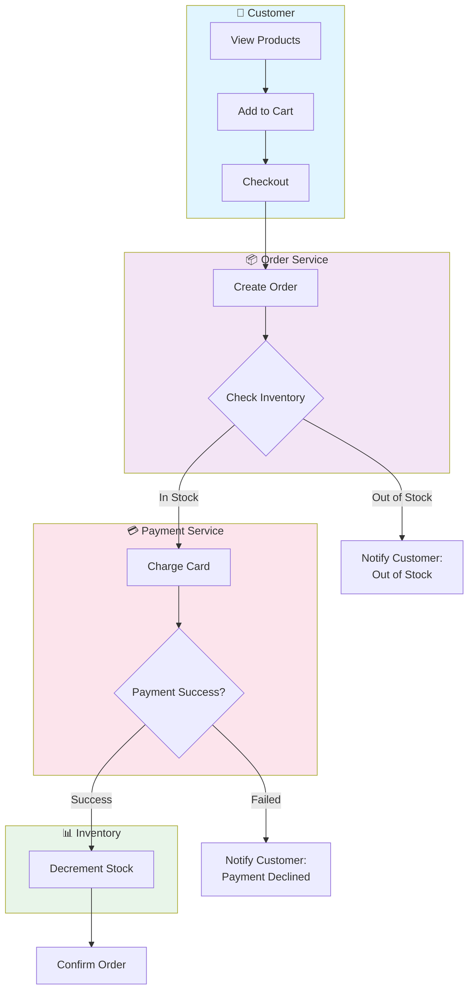
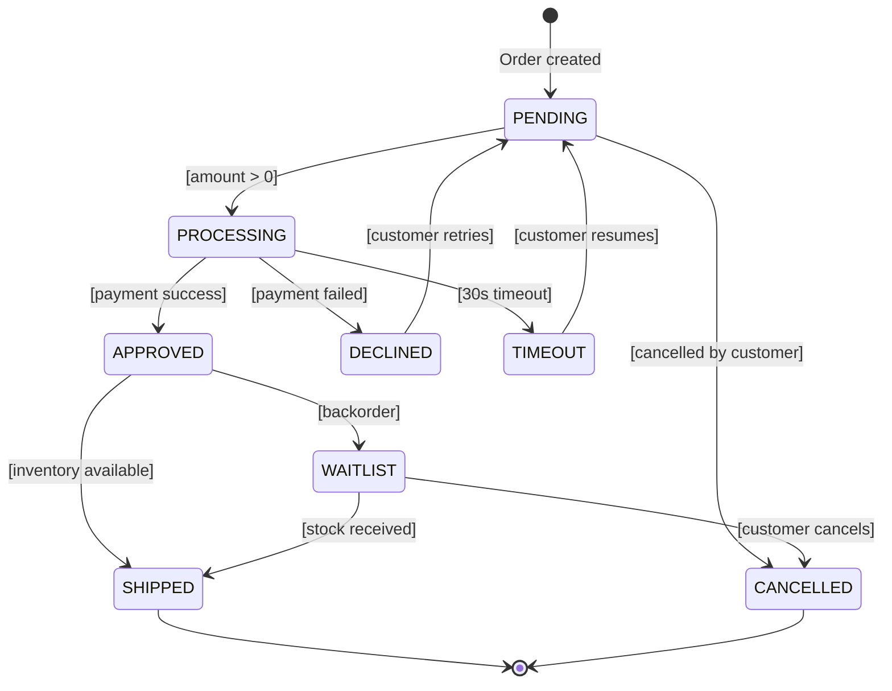

# Flowcharts: Logic & Pipeline Heuristics

Use flowcharts exclusively for decision trees, CI/CD pipelines, and complex branching logic.

---

## Decision Tree: Flowchart vs. State Machine vs. Swimlane Diagram

Before drawing a flowchart, evaluate the core nature of the problem:

- **Condition**: Multiple actors/systems involved (e.g., Customer, Order Service, Payment Gateway, Shipping)?
  - **Action**: Use a **Swimlane Flowchart** with one lane per actor. Shows who does what, in sequence, across boundaries.

- **Condition**: Complex guard conditions on transitions [if amount > 1000, require approval]?
  - **Action**: Use **State Machine** with explicit guard conditions.

---

## Decision Tree: State Machine vs. Flowchart

Before drawing a flowchart, evaluate the core nature of the problem:

- **Condition**: Does the logic primarily react to external events, shifting between resting states?
  - **Action**: ABORT flowchart creation. You must generate a State Diagram (`stateDiagram-v2`) instead. Flowcharts cannot accurately model event-driven resting states and lifecycle boundaries.
- **Condition**: Does the logic represent a sequential algorithmic process, a decision matrix, or a pipeline?
  - **Action**: Proceed with a Flowchart.

## Heuristic: Pipeline Checkpoints

When modeling automated pipelines (CI/CD, ETL, Data Processing):

- **Trap**: Drawing a linear sequence without failure states.
- **Expert Move**: Every external dependency, build step, or validation MUST have a decision diamond (`{Check Pass?}`).
- Explicitly route the `No` path to an alerting, rollback, or manual intervention node. A pipeline without failure paths is a fantasy.

## Heuristic: Cognitive Load Management

- Avoid crossed lines by structuring the flow strictly Top-to-Bottom (`TD`) or Left-to-Right (`LR`). Do not mix them haphazardly.
- Group related activities within `subgraph` boundaries representing environments (e.g., `Dev`, `Prod`) or execution contexts (e.g., `Main Thread`, `Worker Pool`). This provides necessary context without cluttering the individual node names.

## Heuristic: The Manual Intervention Gateway

- In automated processes, clearly differentiate automated nodes from human-in-the-loop nodes.
- Use a distinct shape (like a Trapezoid `[\Manual Approval\]`) for nodes requiring human action. This visually highlights operational bottlenecks in the architecture.

---

## Pattern: Swimlane Flowcharts (Multi-Actor Processes)

When multiple actors (Customer, OrderService, PaymentGateway, InventoryService) are involved, use **swimlanes** to show who does what:

**Key Points**:

- One `subgraph` per actor/system/lane
- Arrows cross boundaries to show interactions
- Clear who initiates each step
- Makes operational dependencies visible

---

## Pattern: State Machines with Guard Conditions

When transitions depend on conditions, explicitly label them with guards:

**Key Points**:

- `[condition]` syntax shows guards
- Guards make decision criteria explicit
- No guard = always transitions on event
- Terminal states clearly marked with `[*]`
