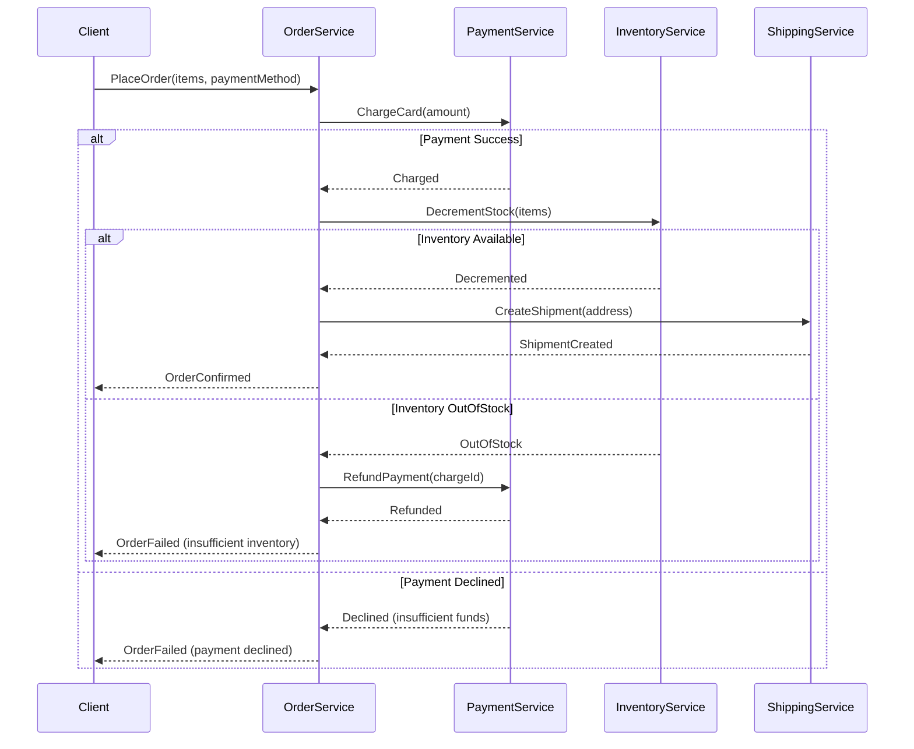

# Sequence Diagrams: Temporal Heuristics

Model the _behavior_ over time. Focus on failure paths, race conditions, and integration boundaries rather than standard happy paths.

## Decision Tree: Synchronous vs. Asynchronous Workflows

When designing inter-service communication:

- **Condition**: Does the caller need an immediate response to proceed?
  - **Action**: Model as Synchronous (`->>`). Explicitly model the thread blocking wait time using activations (`+` and `-`).
- **Condition**: Can the work be done in the background?
  - **Action**: Model as Asynchronous (`-)`). You MUST include the message broker/queue as an explicit participant in the diagram. Do NOT draw a direct line between the services if they communicate via a queue.

## Heuristic: The Compensation Path (Sagas)

- **Trap**: Only modeling the "Happy Path" of a distributed transaction.
- **Expert Move**: You MUST use an `alt` block to model what happens when a downstream service fails in a distributed environment.
  - Show the error response propagating back to the orchestrator.
  - Show the orchestrator sending compensating commands (e.g., `Refund Payment`, `Release Inventory`) to the previously successful services to maintain eventual consistency.

### Template: Distributed Transaction with Compensation

Use this template when modeling multi-step transactions across services:

**Key Steps**:

1. **Happy Path**: Show the primary success flow in the first alt block
2. **Each Async Participant**: After each service succeeds, model what happens if a DOWNSTREAM service fails
3. **Compensation**: Show refunds, reversals, or state resets flowing back through the orchestrator
4. **Terminal State**: Ensure each branch ends with a clear response to the client
5. **Participant Ordering**: Orchestrator in the middle, with suppliers on the right (PaymentService, InventoryService), client on the left

## Heuristic: Rate Limiting and Circuit Breakers

When modeling calls to external 3rd party APIs:

- Introduce a `Gateway` or `Proxy` participant before the external service.
- Use an `opt` or `alt` block to model the Circuit Breaker tripping (e.g., returning `503 Fast Failure`) when the external service is degraded. This visually demonstrates how cascading failures are prevented.

## Heuristic: Participant Ordering

- Order participants strictly from left to right based on the initiator.
- Standard flow: `Client -> Edge (API Gateway) -> Orchestrator -> Domain Service -> Datastore -> Async Broker -> 3rd Party`.
- Breaking this order causes crossed lines and confusing time-travel visuals.
