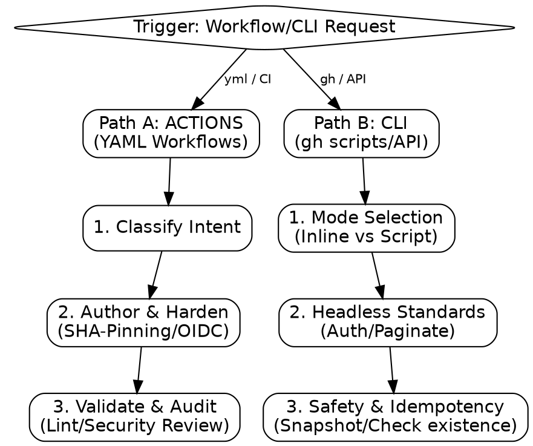

# github-automation

Secure, high-performance GitHub automation.

## Process Flow

## NEVER Do This

- **NEVER** interpolate `${{ github.event... }}` directly into `run:`. **WHY:** This allows attackers to inject malicious shell commands if they control event data (e.g., PR titles). **FIX:** Always pipe inputs through `env:`.
- **NEVER** use `pull_request_target` to check out a PR head without manual auditing. **WHY:** It runs with repository secrets and write permissions; checking out untrusted code allows that code to exfiltrate secrets or corrupt the repo.
- **NEVER** use long-lived cloud credentials (IAM User keys, GCP JSON keys) as GitHub Secrets if the provider supports OIDC. **WHY:** Secrets never expire; OIDC tokens are short-lived and cryptographically bound to the specific repo/job.

## Routing Logic

| Signal                                                    | Path                |
| :-------------------------------------------------------- | :------------------ |
| `.github/workflows/*.yml`, \"add CI\", \"set up release\" | **Path A: ACTIONS** |
| `gh` script, batch API, headless automation               | **Path B: CLI**     |

## PATH A — ACTIONS: YAML Workflows

1. **Classify Intent:** Map to recipe (CI, Release, Deploy, Matrix, Reuse).
2. **Author with Hardening (Non-Negotiable):**
   - **SHA-Pinning:** Replace `@v4` with `@<full_sha>`.
     - **Command:** `python3 scripts/pin_actions.py path/to/workflow.yml`
   - **Permissions:** Default to `contents: read`. Widen only where needed.
   - **OIDC:** Use `id-token: write` and cloud OIDC actions (AWS, GCP, Azure, HashiCorp Vault).
3. **Validate:**
   - **Command:** `python3 scripts/lint.py path/to/workflow.yml`
   - Report linter tier (actionlint | python-lint).
4. **Audit:** Dispatch `general-purpose` subagent for semantic security review.

## PATH B — CLI: GitHub CLI Automation

1. **Mode Selection:** One-off command (inline) vs. Headless script (file).
2. **Headless Standards:**
   - Set `GH_PROMPT_DISABLED=1`.
   - Verify auth via `gh auth status` before mutation.
   - Use `gh api --paginate` with `--jq` for structured output.
3. **Safety:** Snapshot IDs before batch mutations. Add jitter/sleep for write loops.
4. **Idempotency:** Check existence before `POST`; prefer `PATCH`.

## Mandatory Security Checklist

- [ ] `permissions:` set explicitly (no reliance on defaults).
- [ ] All third-party actions pinned to 40-char SHA via `pin_actions.py`.
- [ ] Untrusted inputs piped through `env:`, never `run:` interpolation.
- [ ] No long-lived cloud credentials (OIDC only for AWS/GCP/Azure/npm/PyPI).
- [ ] `pull_request_target` audited for PR head checkout (Forbidden).

## Transition

1. **Fail:** Invoke `diagnose` or `refactor` based on blocking issue type.
2. **Script Error:** If any `gh` or automation script fails, immediately handoff to `diagnose` with the error trace.
