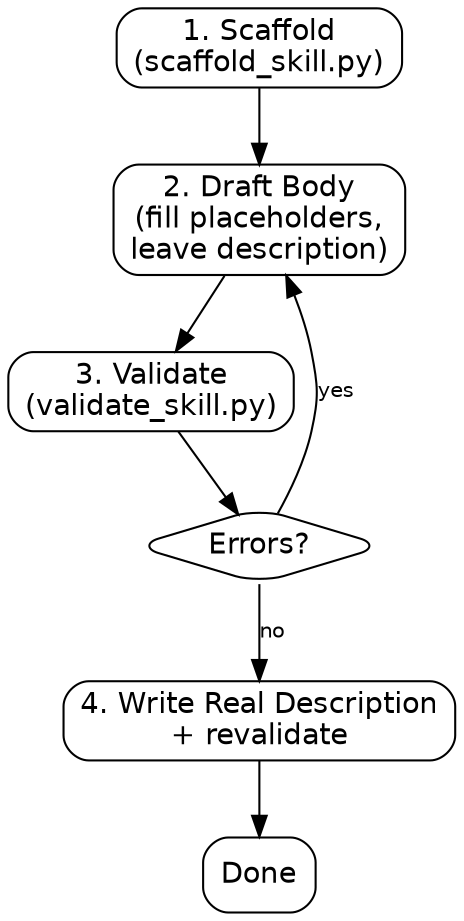

# make-a-skill

Scaffold a new skill from a template, draft its body, then validate it before calling it done.

## Process Flow



## Step 1: Scaffold

```bash
python "$CLAUDE_PLUGIN_ROOT/skills/make-a-skill/scripts/scaffold_skill.py" <name> [--scripts] [--references] [--evals] [--skill-rules]
```

`<name>` must be a lowercase, kebab-case directory name (e.g. `make-a-skill`). Add `--scripts`/`--references`/`--evals` only for the sibling directories the skill actually needs — don't stub directories it won't use. Pass `--skill-rules` to print a suggested JSON snippet for `skill-rules.json` (for hook-based activation). Writes `.claude/skills/<name>/SKILL.md` by default (the standard project-level location); pass `--dir skills` instead when the skill being authored ships inside a plugin's own `skills/` directory. Every section, including `description`, is written as a `{{FILL: ...}}` placeholder except `name`.

## Step 2: Draft the body

Fill in every `{{FILL: ...}}` placeholder **except** `description` — leave that one alone for now. Ground each section in a real, concrete procedure; don't write generic advice the agent already knows (see `references/checklist.md` §Calibration). If the skill doesn't need a branching Process Flow diagram, delete that section entirely rather than leaving a trivial one.

## Step 3: Validate (structural pass)

```bash
python "$CLAUDE_PLUGIN_ROOT/skills/make-a-skill/scripts/validate_skill.py" <name>
```

Fix every `[X]` ERROR before continuing — these include leftover `{{FILL` placeholders, a `name`/directory mismatch, and dangling links to `references/`/`scripts/`/`evals/` files that don't exist. Review `[!]` WARNINGs (vague adjectives, passive voice, an unreferenced sibling file, a too-long body with no `references/` split) but they don't block progress on their own — use judgment.

## Step 4: Write the real description, then revalidate

Only now, with the body finished, replace the placeholder `description`. It must be third person, state what the skill is for, name the sibling skill to use instead when this one doesn't apply, and end with an explicit `Trigger on: 'phrase one', 'phrase two', ...` clause listing literal phrases a user might type (see `references/checklist.md` §Description). Writing it last, instead of up front, means it describes what the skill actually became rather than what it was guessed to be.

Re-run Step 3's command. It must report `VALID (0 error(s), ...)` before the skill is considered done. Zero errors is mandatory; outstanding warnings are a judgment call.

## NEVER

- **NEVER** write the real `description` before the body is drafted. **WHY:** the two-pass split exists so the description reflects what the skill actually does, not a guess made before any of it was written. **FIX:** leave the `{{FILL` placeholder through Step 3; only do Step 4 after Step 3 passes.
- **NEVER** skip a repo's own plugin-wide validation (e.g. this plugin's own `npm run validate`) just because `validate_skill.py` passed. **WHY:** `validate_skill.py` checks one skill in isolation; a repo-wide validator may check things this can't see (plugin manifest, cross-skill consistency). **FIX:** run both if the target repo has one.
- **NEVER** hand-write a SKILL.md skeleton instead of running `scaffold_skill.py`. **WHY:** hand-copying drifts from the placeholder-marker convention `validate_skill.py` depends on to catch unfinished sections. **FIX:** always scaffold first.

**next skills:**

- `architecting`: If drafting the body surfaces a structural question — where shared logic should live across two skills, or a circular reference between two `references/` files. This skill is otherwise a leaf step in skill authoring; there's no required next skill on the happy path.
