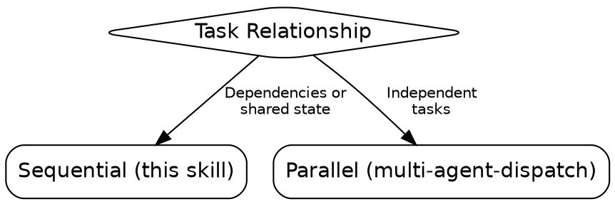
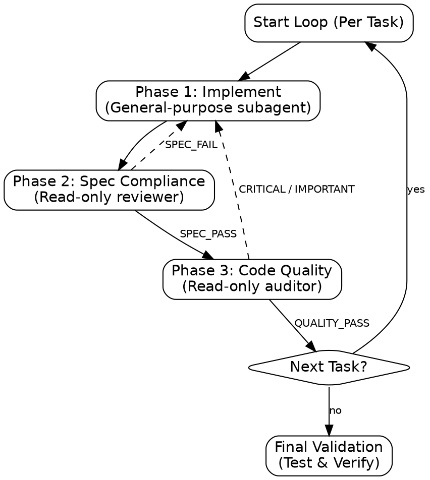

# multi-agent-development

Orchestrate sequential task execution with zero context pollution and high quality-assurance.

## When to Use

## Process Flow

## NEVER Do This

- **NEVER** skip Phase 2 or 3 to save time. **WHY:** Bypassing gates leads to regression and spec drift.
- **NEVER** trust a summary. Verify actual code changes yourself.
- **NEVER** reuse subagents across tasks. **WHY:** Context pollution from previous tasks will cause hallucinations.
- **NEVER** dispatch a reviewer without reading the prompt file first. **WHY:** Reference paths are NOT automatically resolved by subagents; you must load the text.
- **NEVER** start implementation without verifying **disjoint file sets**. **WHY:** Parallel or sequential tasks must not overlap on the same files unless dependencies are explicitly managed.

## Decision Gate

- **Dependencies or shared state?** → **Sequential** (This skill).
- **Independent tasks?** → **Parallel** (`multi-agent-dispatch`).

## Step 0: Confirm

**action: Autonomy Confirmation**
This skill dispatches multiple subagents per task (implementer + up to 2 reviewers, × up to 2 retries each). Before starting, confirm via `AskUserQuestion` — the tool supplies a free-text "Other" automatically, so don't add one manually:

1. ✅ **Recommended** — Proceed with multi-agent-development for [N tasks from plan]. This will start an autonomous session (~[N × 3-9] calls).
2. **Alternative** — Run a single task first to validate the approach before committing to all N.

## Partitioning & Scope

**action: Partition Tasks**
Analyze the plan and confirm task assignments via `AskUserQuestion` — the tool supplies a free-text "Other" automatically, so don't add one manually:

1. ✅ **Recommended** — [Task Sequence] based on [file dependencies and disjoint sets].
2. **Alternative** — [Grouped Tasks] + the dependency reasoning that would justify grouping instead.

3. Verify no two tasks touch the same file unless they are strictly ordered.
4. If overlap is found, you MUST consolidate those tasks or ensure the downstream task receives the upstream task's commits as context.

## The Core Loop (Per Task)

Execute Phases 1 → 2 → 3 in strict order.

### Phase 1: Implement

- Dispatch a `general-purpose` subagent with `isolation: \"worktree\"`.
- **Prompt Contract:** Read [`../multi-agent-dispatch/references/subagent-contract.md`](../multi-agent-dispatch/references/subagent-contract.md) and carry `SCOPE`, `OBJECTIVE`, `CONTEXT`, `CONSTRAINTS`, `OUTPUT SCHEMA`. (Shared with `multi-agent-dispatch` by reference, not copy — if that skill is ever removed/renamed, update this path too.)
- **Outcome:** `VERDICT: [DONE | DONE_WITH_CONCERNS | BLOCKED | NEEDS_CONTEXT]`, `FILES_TOUCHED`, `COMMIT`, `SUMMARY`.

### Phase 2: Spec Compliance Gate

- **MANDATORY**: Read `references/spec-reviewer-prompt.md` and use its content as the prompt for the Reviewer.
- Dispatch a read-only `general-purpose` agent as Reviewer.
- **Contract:** Expect `VERDICT: [SPEC_PASS | SPEC_FAIL]`, `MISSING_REQUIREMENTS`, `EXTRA_WORK`.
- **Check:** Did implementer build everything? Anything extra?
- **Failure:** Dispatch implementer to fix. Max 2 attempts before escalating as BLOCKED.

### Phase 3: Code Quality Gate

- **MANDATORY**: Read `references/quality-reviewer-prompt.md` and use its content as the prompt for the Quality Auditor.
- Dispatch a read-only `general-purpose` agent as Quality Auditor.
- **Contract:** Expect `VERDICT: [QUALITY_PASS | CRITICAL | IMPORTANT | MINOR]`, `CRITICAL_ISSUES`, `IMPORTANT_ISSUES`.
- **Check:** Responsibility, decomposition, error handling, test coverage.
- **Severity:** `CRITICAL` (Block), `IMPORTANT` (Block), `MINOR` (Log).

## Final Validation

Advance only after Phase 3 passes. After ALL tasks pass:

1. Run the project's test and validate commands (read from `AGENTS.md` / package manifest — never assume `npm`).
2. Invoke `verification-before-completion`.
3. Invoke `request-code-review`. **MANDATORY, not optional** — Phase 3's quality gate does not check security (see Check 7 in `quality-reviewer-prompt.md`); `request-code-review` Tier 1 is the only security gate in this workflow.

**next skills:**

- `verification-before-completion`: After all tasks in the plan are complete and pass quality gates, to ensure system-wide integrity.
- `request-code-review`: Mandatory fresh-context security and correctness audit before merging — the quality gate in this skill does not cover security.

## Operational Rules

- **Fresh agent per task.**
- **Prompt Discipline:** Subagents start cold. Embed every fact.
- **Commit Baseline:** Always provide `Baseline commit` and `Implementation commit` to reviewers for precise diffing.
