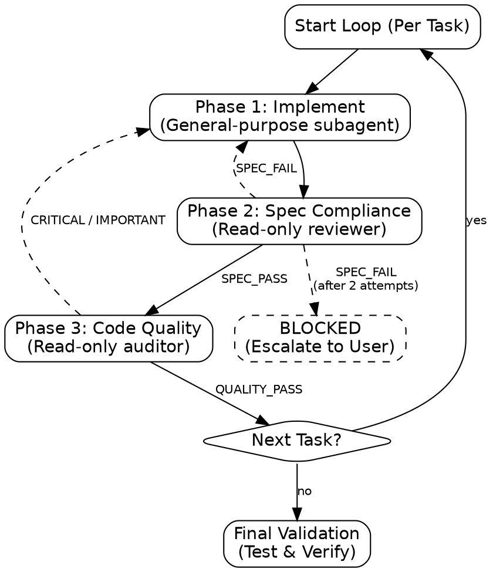

# multi-agent-development

Orchestrate sequential task execution with zero context pollution and high quality-assurance.

## When to Use

- **Dependencies or shared state across tasks?** → Sequential (this skill).
- **Fully independent tasks, no shared state?** → Parallel (`multi-agent-dispatch`).

## Process Flow

## NEVER Do This

- **NEVER** skip Phase 2 or 3 to save time. **WHY:** Bypassing gates leads to regression and spec drift.
- **NEVER** trust a summary. Verify actual code changes yourself.
- **NEVER** reuse subagents across tasks. **WHY:** Context pollution from previous tasks will cause hallucinations.
- **NEVER** dispatch a reviewer without reading the prompt file first. **WHY:** Reference paths are NOT automatically resolved by subagents; you must load the text.
- **NEVER** start implementation without verifying **disjoint file sets**. **WHY:** Parallel or sequential tasks must not overlap on the same files unless dependencies are explicitly managed.
- **NEVER** start the next task's Phase 1 before the current task's worktree commit is merged into the sequence baseline. **WHY:** Merging ahead breaks the guarantee that each fresh agent starts cold from a known-good baseline — if the current task is later rejected, the next task's work is already built on a commit that's about to be discarded.
- **NEVER** treat a conflict-free merge as proof of correctness. **WHY:** Git silently merges non-conflicting but semantically wrong changes (e.g., Task N+1 calling a Task N helper that was renamed without a textual conflict). A clean merge only means no overlapping lines — re-run the project's quick build/typecheck command after each merge, not just at Final Validation, so a regression is traced to the task that caused it.

## Step 0: Confirm

**action: Autonomy Confirmation**
This skill dispatches multiple subagents per task (implementer + up to 2 reviewers, × up to 2 retries each). Before starting, confirm via `AskUserQuestion` — the tool supplies a free-text "Other" automatically, so don't add one manually:

1. ✅ **Recommended** — Proceed with multi-agent-development for [N tasks from plan]. This will start an autonomous session (~[N × 3-9] calls).
2. **Alternative** — Run a single task first to validate the approach before committing to all N.

## Partitioning & Scope

**action: Partition Tasks**
Analyze the plan and confirm task assignments via `AskUserQuestion` — the tool supplies a free-text "Other" automatically, so don't add one manually:

1. ✅ **Recommended** — [Task Sequence] based on [file dependencies and disjoint sets].
2. **Alternative** — [Grouped Tasks] + the dependency reasoning that would justify grouping instead.

3. Verify no two tasks touch the same file unless they are strictly ordered.
4. If overlap is found, you MUST consolidate those tasks or ensure the downstream task receives the upstream task's commits as context.

## The Core Loop (Per Task)

Execute Phases 1 → 2 → 3 in strict order.

### Phase 1: Implement

- Dispatch a `general-purpose` subagent with `isolation: \"worktree\"`.
- **MANDATORY**: Read `references/implementer-prompt.md` and use its content to structure the prompt for the Implementer.
- **Prompt Contract:** Read [`references/subagent-contract.md`](references/subagent-contract.md) and carry `SCOPE`, `OBJECTIVE`, `CONTEXT`, `CONSTRAINTS`, `OUTPUT SCHEMA`.
- **Outcome:** `VERDICT: [DONE | DONE_WITH_CONCERNS | BLOCKED | NEEDS_CONTEXT]`, `FILES_TOUCHED`, `COMMIT`, `SUMMARY`.
- **Do NOT load** `spec-reviewer-prompt.md` or `quality-reviewer-prompt.md` for this phase.

### Phase 2: Spec Compliance Gate

- **MANDATORY**: Read `references/spec-reviewer-prompt.md` and use its content as the prompt for the Reviewer.
- **Do NOT load** `quality-reviewer-prompt.md` yet — that's Phase 3 only.
- Dispatch a read-only `general-purpose` agent as Reviewer.
- **Contract:** Expect `VERDICT: [SPEC_PASS | SPEC_FAIL]`, `MISSING_REQUIREMENTS`, `EXTRA_WORK`.
- **Check:** Did implementer build everything? Anything extra?
- **Failure:** Dispatch implementer to fix. Max 2 attempts before escalating as BLOCKED.
- **BLOCKED escalation behavior:** escalating as BLOCKED **pauses the entire sequential plan**, not just the current task. Do not proceed to the next task in the sequence — later tasks were partitioned assuming this one's output exists, so continuing past a BLOCKED task lets downstream work build on a missing/broken foundation. Report the BLOCKED task and its failure reason to the user and wait for a directive (revise the task, skip it explicitly with downstream tasks re-scoped, or abandon the plan) before resuming.

### Phase 3: Code Quality Gate

- **MANDATORY**: Read `references/quality-reviewer-prompt.md` and use its content as the prompt for the Quality Auditor.
- **Do NOT** re-read `implementer-prompt.md` or `spec-reviewer-prompt.md` for this phase unless dispatching a retry.
- Dispatch a read-only `general-purpose` agent as Quality Auditor.
- **Contract:** Expect `VERDICT: [QUALITY_PASS | CRITICAL | IMPORTANT | MINOR]`, `CRITICAL_ISSUES`, `IMPORTANT_ISSUES`.
- **Check:** Responsibility, decomposition, error handling, test coverage.
- **Severity:** `CRITICAL` (Block), `IMPORTANT` (Block), `MINOR` (Log).
- **Retry counters are per-gate, not shared.** Phase 2 and Phase 3 each cap at 2 attempts independently — a task that fails Phase 2 once and Phase 3 twice has cost more than the "3-9 calls" baseline estimate (Step 0) before any BLOCKED fires. Don't assume a Phase 3 failure counts against the Phase 2 budget or vice versa.

## Final Validation

Advance only after Phase 3 passes. After ALL tasks pass:

1. Run the project's test and validate commands (read from `AGENTS.md` / package manifest — never assume `npm`).
2. Invoke `verification-before-completion`.
3. Invoke `request-code-review`. **MANDATORY, not optional** — while Phase 3's quality gate performs basic security sanity checks (see Check 7 in `quality-reviewer-prompt.md`), a fresh-context comprehensive security audit requires `request-code-review` Tier 1.

**next skills:**

- `verification-before-completion`: After all tasks in the plan are complete and pass quality gates, to ensure system-wide integrity.
- `request-code-review`: Mandatory fresh-context security and correctness audit before merging — the local quality gate performs only basic security sanity checks.

## Operational Rules

- **Fresh agent per task.**
- **Prompt Discipline:** Subagents start cold. Embed every fact.
- **Commit Baseline:** Always provide `Baseline commit` and `Implementation commit` to reviewers for precise diffing.
- **Rejection rollback policy:** when Phase 2 or Phase 3 sends a task back to Phase 1 (`SPEC_FAIL`/`CRITICAL`/`IMPORTANT`), the rejected attempt's worktree commit is discarded, not merged-then-reverted — the next Phase 1 dispatch starts a fresh agent in a fresh worktree from the same baseline commit, with the reviewer's findings embedded in its prompt. Never carry forward a rejected attempt's partial diff into the retry; restarting from the baseline commit prevents compounding a flawed approach. Once a task fully passes Phase 3, its worktree commit is merged into the sequence baseline before the next task starts. **If the merge conflicts:** BLOCKED state — re-run the disjoint-files check (Partitioning & Scope section) and escalate to the user before attempting to manually resolve or skip the failed task.
- **Resuming after interruption:** if the orchestrating session restarts mid-task, inspect the worktree's `git log` before redispatching Phase 1 — a prior attempt may have already committed; don't duplicate work by dispatching blind.
