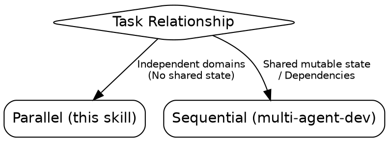
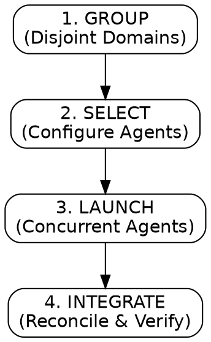

# multi-agent-dispatch

Maximize efficiency through parallel execution across isolated problem domains.

## When to Use



## Process Flow



## NEVER Do This

- **NEVER** launch parallel subagents if their write-paths overlap. **WHY:** This causes race conditions and git conflicts. **FIX:** Use `multi-agent-development` for sequential execution.
- **NEVER** assume a subagent has context from the parent thread. **WHY:** Subagents start cold. **FIX:** Embed every necessary fact verbatim in the prompt.
- **NEVER** launch more than 5 subagents in a single batch. **WHY:** This risks hitting rate limits and can lead to context window explosion in the main thread.
- **NEVER** accept subagent reports as final truth. **WHY:** Subagents can hallucinate success. **FIX:** You MUST run the project's test suite to verify all claims.

## Dispatch Gate

Answer BOTH before spawning:

1. **Authorized?** User requested parallel/agent work OR parent skill phase calls for it.
2. **Independent?** 2+ domains with NO shared mutable state (disjoint files/hypotheses).
   → If NO to either: Investigate inline or sequentially.

## The Four-Step Loop

1. **GROUP:** Split work into independent domains. One agent per domain. Name what is OUT of scope.
2. **SELECT:** Configure `general-purpose` agents with specialized roles in prompt constraints.
   - **Investigator (Read-only):** Trace root cause, provide fix as code block. No edits.
   - **Writer (Isolation: worktree):** Implement spec, write tests, report changes.
   - **Researcher (Read-only):** Explore code/docs, report file paths and usages.
3. **LAUNCH:**
   - Enumerate each subagent's intended write-paths (from its SCOPE).
   - Diff them against every other subagent's write-paths.
   - **Limit:** Max 5 concurrent agents per batch.
   - If disjoint, emit ALL `Agent` calls in **ONE message** for true concurrency.
4. **INTEGRATE:** Reconcile findings/diffs. Run full project validation.

## Subagent Prompt Contract (Zero-Shot)

Every prompt MUST contain:

- **SCOPE:** Validated paths (In/Out of bounds).
- **OBJECTIVE:** One concrete verifiable/falsifiable outcome.
- **CONTEXT:** Error text, versions, baseline commit — everything to start cold.
- **CONSTRAINTS:** Tool restrictions and specific "Do Not" rules.
- **OUTPUT SCHEMA:** Instruct subagents to return data in this format:
  ```text
  VERDICT: [SUCCESS | FAILURE | BLOCKED]
  FILES_TOUCHED: [list of paths]
  SUMMARY: [concise what was done]
  EVIDENCE: [test results or grep output]
  ```

## Integration Rules

- **Reads are free.** Writes MUST be disjoint to avoid stomping.
- **Validate Claims.** Never trust a report without running the test suite.

## Success Criteria

All results reconciled, test suite GREEN, handed to `verification-before-completion`.
