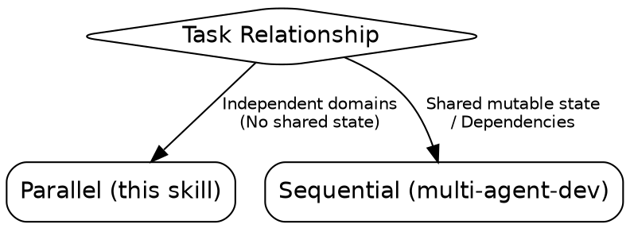
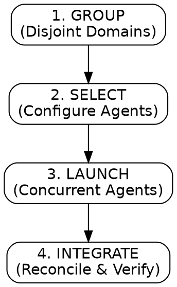

# multi-agent-dispatch

Maximize efficiency through parallel execution across isolated problem domains.

## When to Use

## Process Flow

## NEVER Do This

- **NEVER** launch parallel subagents if their write-paths overlap. **WHY:** This causes race conditions and git conflicts. **FIX:** Use `multi-agent-development` for sequential execution.
- **NEVER** assume a subagent has context from the parent thread. **WHY:** Subagents start cold. **FIX:** Embed every necessary fact verbatim in the prompt.
- **NEVER** launch more than 5 subagents in a single batch. **WHY:** This risks hitting rate limits and can lead to context window explosion in the main thread.
- **NEVER** accept subagent reports as final truth. **WHY:** Subagents can hallucinate success. **FIX:** You MUST run the project's test suite to verify all claims.

## Dispatch Gate

Answer BOTH before spawning:

1. **Authorized?** User requested parallel/agent work OR parent skill phase calls for it.
2. **Independent?** 2+ domains with NO shared mutable state (disjoint files/hypotheses).
   → If NO to either: Investigate inline or sequentially.

## The Four-Step Loop

**action: Group Tasks**
Analyze the work and confirm the parallel grouping via `AskUserQuestion`:

1. ✅ **Recommended** — [Groups] based on [disjoint files/hypotheses].
2. **Alternative** — [Alternative Grouping] + justification.
3. **Other** — Custom groups.

4. **SELECT:** Configure `general-purpose` agents with specialized roles per the Role Vocabulary in [`references/subagent-contract.md`](references/subagent-contract.md) (Investigator/Writer/Researcher). For read-only roles, explicitly instruct no Write/Edit — and note this is an instruction, not an enforced restriction, unless the harness supports a tool allowlist.
5. **LAUNCH:**
   - Enumerate each subagent's intended write-paths (from its SCOPE).
   - Diff them against every other subagent's write-paths.
   - **Limit:** Max 5 concurrent agents per batch.
   - If disjoint, emit ALL `Agent` calls in **ONE message** for true concurrency.
6. **INTEGRATE:** Reconcile findings/diffs. Run full project validation.

**next skills:**

- `verification-before-completion`: Once all parallel tasks are integrated, to verify the final combined state against project standards.

## Subagent Prompt Contract (Zero-Shot)

**MANDATORY**: Read [`references/subagent-contract.md`](references/subagent-contract.md) — the canonical SCOPE/OBJECTIVE/CONTEXT/CONSTRAINTS/OUTPUT SCHEMA contract and role vocabulary used by every dispatching skill in this ecosystem.

## Integration Rules

- **Reads are free.** Writes MUST be disjoint to avoid stomping.
- **Validate Claims.** Never trust a report without running the test suite.

## Success Criteria

All results reconciled, test suite GREEN, handed to `verification-before-completion`.
