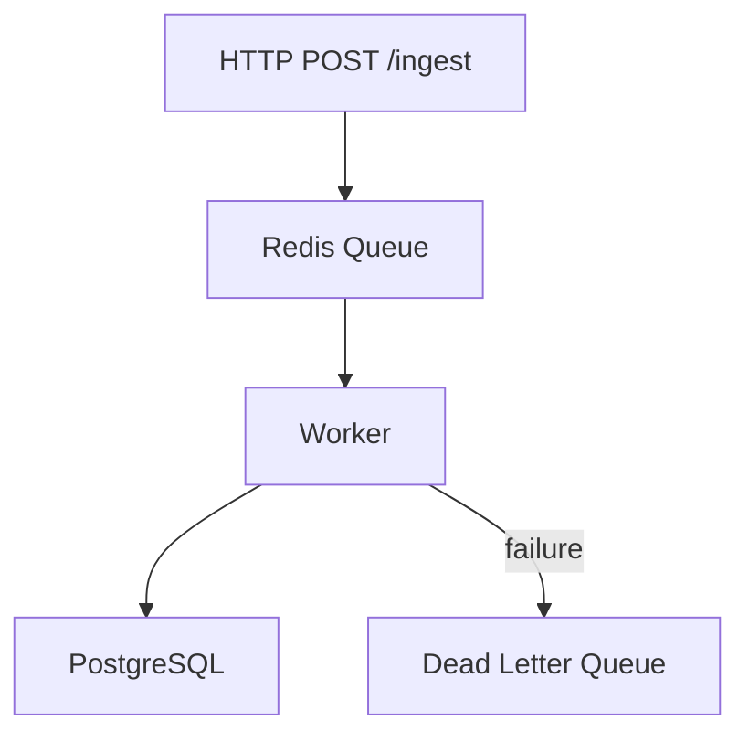

# Domain-Specific Examples

## REST API

Use `scaffold.py --domain api` to inject standard API snippets automatically.

**Requirements pattern:**

```markdown
- `SEC-001`: All requests MUST include a valid Bearer token in the Authorization header.
- `REQ-001`: The API MUST return JSON for all successful and error responses.
- `PERF-001`: The endpoint MUST respond within 200ms at p99 under 100 RPS.
```

**Interface pattern (mandatory error cases):**

```markdown
### POST /api/v1/users

**Input:** `email` (string, required), `password` (string, required, min 8 chars)
**Output:** `{ id, email, createdAt }`
**Errors:**

- `400`: Missing required fields or invalid schema
- `401`: Unauthorized — missing or invalid Bearer token
- `409`: Conflict — email already registered
- `500`: Internal server error
```

**Constraint pattern:**

```markdown
- `CON-001`: The solution MUST NOT store passwords in plaintext.
- `CON-002`: The response payload MUST NOT exceed 64 KB.
```

---

## CLI Tool

Use `scaffold.py --domain cli` to inject CLI snippets automatically.

**Requirements pattern:**

```markdown
- `REQ-001`: The tool MUST support `--json` for machine-readable output.
- `REQ-002`: The tool MUST exit with a non-zero code on any failure.
- `COMP-001`: The tool MUST be compatible with POSIX-compliant shells (bash, zsh).
```

**Interface pattern:**

```markdown
### migrate run

**Input:** `[--dry-run] [--env staging|production]`
**Output:** Migration status (stdout), errors (stderr)
**Errors:**

- Exit 1: Database connection failure
- Exit 2: Migration file not found
- Exit 0: Success (all migrations applied)
```

---

## Database schema

**Requirements pattern:**

```markdown
- `REQ-001`: The schema MUST support soft-delete (deleted_at timestamp, nullable).
- `CON-001`: The solution MUST NOT alter the existing `users_legacy` table.
- `PERF-001`: All foreign-key lookups MUST be covered by an index.
```

**Interfaces (table definition):**

```markdown
### Table: events

| Column     | Type        | Constraints                            |
| ---------- | ----------- | -------------------------------------- |
| id         | UUID        | PRIMARY KEY, DEFAULT gen_random_uuid() |
| user_id    | UUID        | REFERENCES users(id) ON DELETE CASCADE |
| type       | VARCHAR(50) | NOT NULL                               |
| payload    | JSONB       | NOT NULL                               |
| created_at | TIMESTAMPTZ | NOT NULL DEFAULT now()                 |
| deleted_at | TIMESTAMPTZ | NULL                                   |
```

---

## Blueprint distributed system

For high-throughput pipelines, add to `Notes & Risks`:

````markdown
## 8. Notes & Risks

- `RISK-001`: Redis restart may drop queued events — mitigation: enable AOF persistence.
- `RISK-002`: PostgreSQL migration failure may leave schema in inconsistent state — mitigation: wrap in transaction, rollback on error.
- `NOTE-001`: Deploy worker process before enabling the HTTP ingest endpoint.



```

```
````
