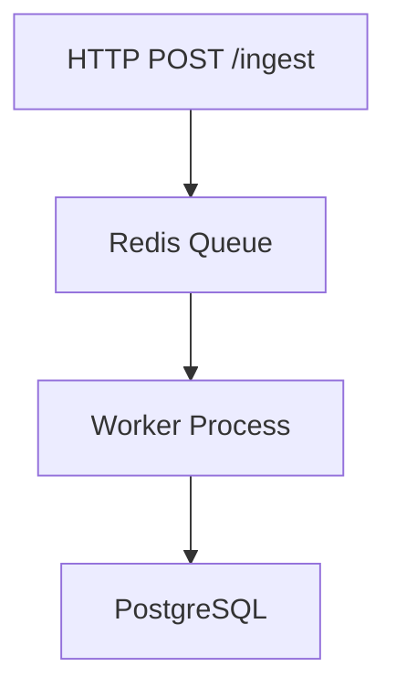

# Output Examples by Depth

## sketch — Exploratory

Light spec (Goal + top REQs), compact phases, no deep discovery.

**Spec excerpt (`auth-sketch.specs.md`):**

```markdown
# auth-sketch

## 1. Goal

- Enable users to authenticate with an email/password form.
- Completion signal: Users can log in and see their dashboard.

## 2. Requirements

- `REQ-001`: The form MUST accept email and password fields.
- `REQ-002`: Invalid credentials MUST display an error message.

## 4. Interfaces

- POST /auth/login — email + password in, JWT out
```

**Plan excerpt (`auth-sketch.plan.md`):**

```markdown
## PHASE-001: Implementation

### TASK-001: Implement REQ-001

Depends on: none
Files: [UNVERIFIED](UNVERIFIED)
Symbols: none
Satisfies: REQ-001
Action: Add email/password form component.
Validate: `npm test -- login.test.ts`
Expected result: Tests pass.
```

---

## contract — Build-ready (default)

Full 8-section spec with interface errors; atomic tasks with verified paths.

**Spec excerpt (`auth-jwt.specs.md`):**

```markdown
## 2. Requirements

- `REQ-001`: The system MUST issue a signed JWT on successful login.
- `SEC-001`: Tokens MUST expire after 3600 seconds.
- `PERF-001`: The login endpoint MUST respond within 200ms at p99.

## 4. Interfaces

The system exposes the following interfaces:

### POST /auth/login

**Input:** `email` (string, required), `password` (string, required)
**Output:** `{ token: string, expiresAt: ISO8601 }`
**Errors:** 400 (missing fields), 401 (invalid credentials), 500 (internal error)

## 6. Acceptance Criteria & Validation

- `AC-001`: A valid login request returns 200 with a JWT token.
- `VAL-001`: `npm test -- auth/login.test.ts`
```

**Plan excerpt (`auth-jwt.plan.md`):**

```markdown
### TASK-003: Implement token signing

Depends on: [TASK-002](#task-002-create-jwt-utilities)
Files: [src/auth/jwt.ts](src/auth/jwt.ts)
Symbols: [signToken](src/auth/jwt.ts#L24)
Satisfies: REQ-001, SEC-001
Action: Implement JWT signing using RS256 with 3600s expiry.
Validate: `npm test -- src/auth/jwt.test.ts`
Expected result: All 6 tests pass, 0 skipped.
```

---

## blueprint — Production-critical

All 8 sections + rollback strategy, Mermaid diagram, narrative runbook tasks.

**Extra spec sections:**

````markdown
## 8. Notes & Risks

- `RISK-001`: Redis restart may drop queued events — mitigation: enable AOF persistence.
- `NOTE-001`: PostgreSQL migration must run in a transaction; rollback on failure.


````

**Extra plan sections:**

```markdown
## PHASE-ROLLBACK: Rollback Procedures

### TASK-020: Rollback database migration

Depends on: none
Files: [migrations/002_add_events_table.sql](migrations/002_add_events_table.sql)
Symbols: none
Satisfies: NOTE-001
Action: Execute `psql -f migrations/rollback_002.sql` to drop the events table.
Validate: `psql -c "\\d events" 2>&1 | grep 'did not exist'`
Expected result: Command confirms table does not exist.
```
