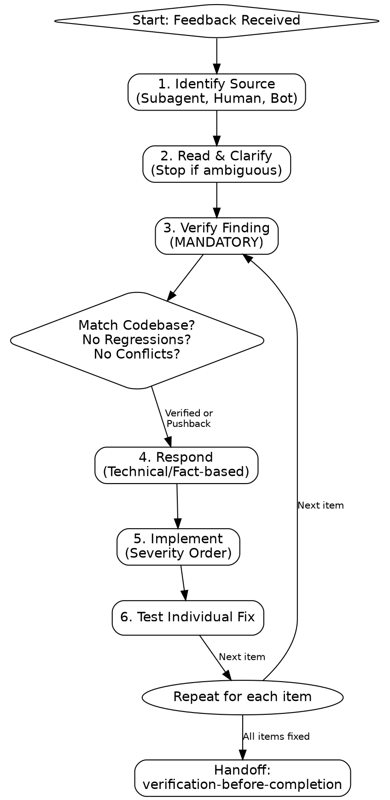

# receive-code-review

Code review feedback requires technical evaluation, not emotional performance or blind compliance. Verify before implementing. Ask before assuming.

## Process Flow

## NEVER Do This

- **NEVER** write a performative-agreement phrase or thank the reviewer (e.g., \"you're right\", \"great catch\"). **WHY:** LLM sycophancy masks technical gaps. The fix is the acknowledgment.
- **NEVER** implement a finding you haven't verified against this codebase. **WHY:** Reviewers (human or AI) can be wrong about local context.
- **NEVER** batch-implement several items then test once. **WHY:** It makes it impossible to isolate which fix caused a regression. **FIX:** One fix, one test, repeat.
- **NEVER** silently accept a suggestion that contradicts a user decision or `AGENTS.md`. **FIX:** Surface the conflict immediately.
- **NEVER** proceed autonomously if a review suggests a rewrite of >10 files or a core architectural change. **FIX:** Stop and ask the user for a \"Directive\" before proceeding.
- **NEVER** dispatch a third re-review of the same range without checking in with the user first.

## 0. Identify the Source

- **`request-code-review`'s dispatched subagent:** Treat as external — it had zero conversational context. Verify findings against the actual codebase; it can be wrong about intent it never saw. Tiers referenced below come from that skill's rubric (Tier 1 security, Tier 2 correctness, Tier 3 performance, Tier 4 reuse/hygiene) — apply the same tiering to non-tiered feedback from the other two sources.
- **Human partner, directly:** Trusted — implement after understanding. Still ask if scope is unclear.
- **External GitHub reviewer/bot/PR comment:** Most scrutiny required.
  - **Tooling:** Use `gh pr view <number> --comments` to read.
  - **Reply:** Reply in the comment thread (`gh api repos/{owner}/{repo}/pulls/{pr}/comments/{id}/replies -f body=\"...\"`), not as a top-level comment, so the reply stays attached to the line under discussion.

## 1. Read Before Reacting

1. Read every item before responding to any of it.
2. If any item is unclear, stop and ask about all unclear items at once — do not implement the items you understand while a related item is still ambiguous; partial understanding produces a wrong implementation.

## 2. Verify (mandatory before implementing)

**MANDATORY**: Read `AGENTS.md` (and `CLAUDE.md`/`GEMINI.md`) to ensure the feedback doesn't contradict established project conventions.

For each finding, before touching code, check:

- [ ] **Codebase-specific correctness:** does this codebase's actual usage (check via `git grep`, tests, or call sites) support the finding, or is it a generic best practice that doesn't apply here?
- [ ] **Regression risk:** does the suggested fix break an existing test or caller? Run the relevant test before and after.
- [ ] **Intentional deviation:** is there a comment, commit message, or prior decision in this conversation explaining why the current code looks this way?
- [ ] **Conflict with a prior decision:** does the suggestion contradict something the user already decided, or `CLAUDE.md`/`AGENTS.md`? If so, stop and raise it — do not silently override either side.
- [ ] **YAGNI:** for \"implement this properly\" suggestions, `git grep` for actual usage. If unused, ask whether to remove it instead of building it out.

If you can't verify a finding without more information, say so and ask how to proceed — never implement a guess.

## 3. Respond

Never use a performative-agreement phrase or thank the reviewer.

- Correct and verified: state the fix factually — `\"Fixed. [what changed]\"` — or just make the change and let the diff speak.
- Wrong, with evidence: push back with technical reasoning, citing the specific file/test/constraint that contradicts the suggestion.
- Can't verify: state the limitation and ask — `\"Can't verify this without [X]. Should I [investigate/ask/proceed]?\"`
- You pushed back earlier and were wrong: `\"Checked [X] — it does [Y]. Fixing.\"` State the correction and move on, no apology spiral.

## 4. Implement in Severity Order

1. Blocking issues first (Tier 1 security, Tier 2 correctness, or equivalent \"must fix\" items from a human/external reviewer).
2. Simple fixes (typos, imports).
3. Complex fixes (refactoring, logic changes).

Test each fix individually as you go — never batch several fixes and run tests once at the end.

## Routing Blocking Issues

- **Tier 1 / Tier 2 (security or correctness):** Invoke `diagnose` to root-cause the issue rather than patching the symptom.
- **Tier 4 (reuse/hygiene) or structural feedback:** Invoke `refactor`.
- After the fix lands: `verification-before-completion`, then back to `request-code-review` for re-review of the same range.
- **Cap at 2 re-review cycles** for the same range. If it fails a second time, stop and report the recurring findings to the user instead of dispatching a third review — repeated failure signals a misunderstanding of the requirement, not a fixable diff.
