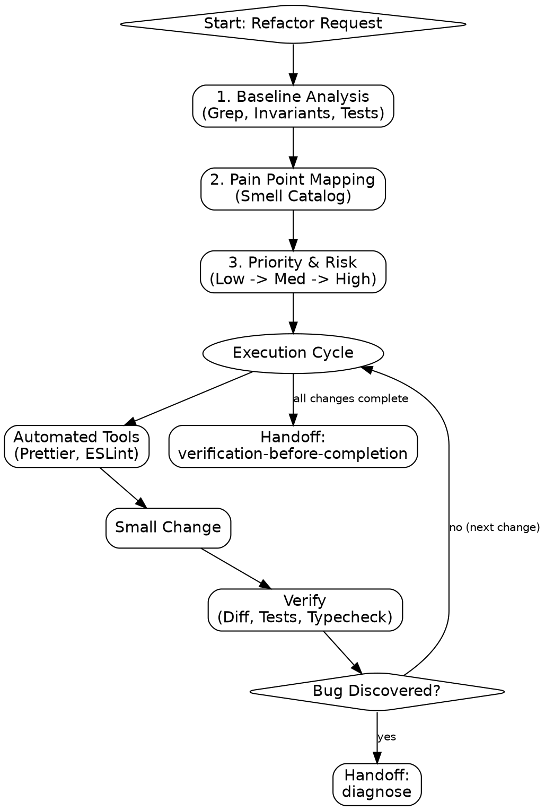

# refactor

Improve structure without changing behavior. Focus on readability, testability, and extensibility.

## Process Flow



## Step 1: Baseline Analysis

Build a mental model before touching code:

- **Blast Radius:** Use `Grep` to find all callers and dependencies.
- **Invariants:** Identify hidden logic requirements.
- **Tests:** Verify current tests exist and pass.

## Step 2: Pain Point Mapping

**action: Map Pain Points**
If vague, ask "What is the hardest part of working with this code?" and confirm via `AskUserQuestion` — the tool supplies a free-text "Other" automatically, so don't add one manually. Ground options in the pain-point table below rather than generic phrasing — if the code shows symptoms matching 2+ rows, surface those as the real options instead of inventing a placeholder second guess:

1. ✅ **Recommended** — [Diagnosis] based on [the table row whose symptom best matches what you observed: nesting, duplication, coupling, naming].
2. **Alternative** — [a second table row whose symptom is also plausible] + the reason it might be the better fit.

**MANDATORY**: If the pain point is vague or complex, you MUST read `references/smell-catalog.md` to accurately diagnose the issue.

| Pain                   | Likely Problem      | Rationale                                 |
| :--------------------- | :------------------ | :---------------------------------------- |
| \"Hard to add cases\"  | Missing Abstraction | Use Strategy, Enum, or Factory.           |
| \"Hard to understand\" | Poor Naming / Bloat | Rename, extract helpers.                  |
| \"Copy-pasted\"        | Duplication         | Extract shared utility (DRY).             |
| \"Tests breaking\"     | Hidden Coupling     | Dependency injection, concern separation. |

## Step 3: Priority & Risk

1. **Low Risk (First):** Rename misnomers, replace magic literals, remove dead code, early returns. **DO NOT load `patterns.md` for these changes.**
2. **Medium Risk:** Split functions, extract classes, introduce types/interfaces.
3. **High Risk (Confirm First):** Reorganize modules, change public API signatures, apply Observer/Strategy patterns. **MANDATORY**: Before applying a pattern, read `references/patterns.md`.

## Step 4: Hidden Bug Protocol

If a bug is discovered during refactoring: **STOP.**

1. Surface the bug (trigger, behavior, fix).
2. **NEVER** fix it in the same turn as the refactor.
3. Leave the buggy line intact. Fix only in a separate, dedicated step (invoke `diagnose`).

## Step 5: Small, Verified Steps

- **Checkpoint:** Commit or stash before starting.
- **Cycle:** One change → Confirm (read diff) → Run tests → Confirm typecheck.
- **Automated Tools:** Run `prettier`, `eslint --fix`, `ruff format`, or `gofmt` before manual edits.

## Step 6: Communication (Mandatory Output)

```markdown
## Changes

**What changed:** [List renames, extractions, reorganizations]
**Why:** [Problem solved / Benefit gained]
**Deliberately NOT changed:** [Preserved scope / Justification]
```

**next skills:**

- `diagnose`: If a pre-existing bug is discovered during the refactor that requires systematic isolation.
- `verification-before-completion`: Once the structural changes are complete, to ensure behavior is preserved.

## Critical Rules

- **NEVER** mix behavior changes with structural changes.
- **NEVER** extract solely on structural similarity (Incidental Duplication).
- **NEVER** change public signatures without test coverage.
- **NEVER** refactor an untested critical path. Write characterization tests first.

## Transition

Invoke `verification-before-completion` after the final test pass.
