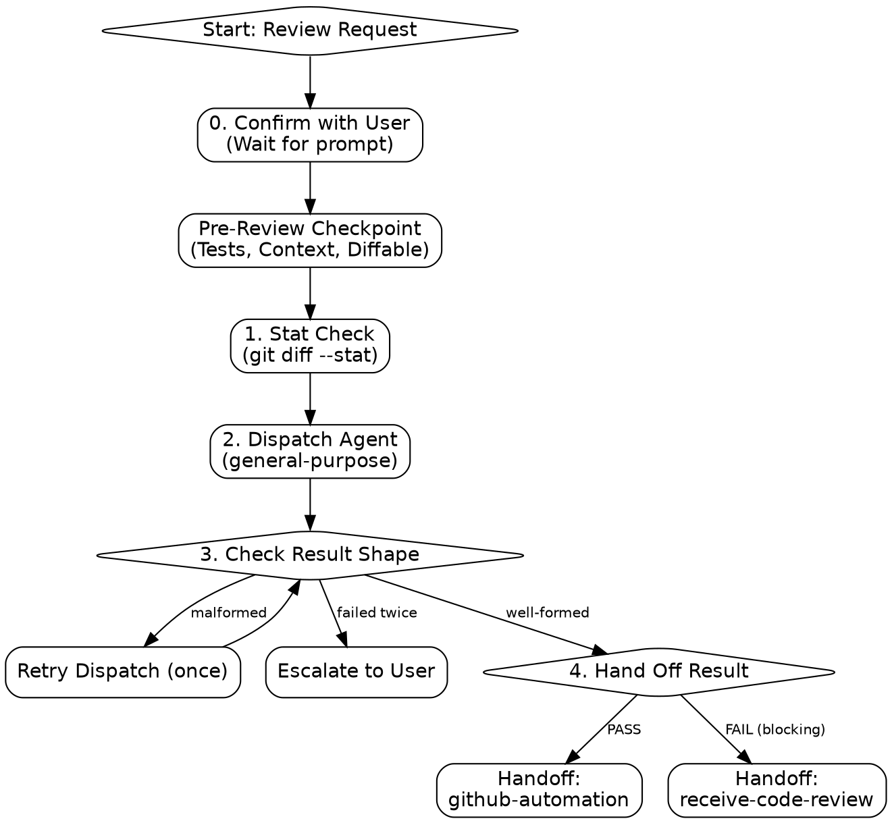

# request-code-review

Get an unbiased review by dispatching a fresh-context subagent. Never review your own work in the same thread that wrote it — you already rationalized every decision once; a subagent with no memory of the implementation reads the diff cold, the way a human reviewer would.

## Process Flow

## Step 0: Confirm

**action: Review Confirmation**
Confirm the start of an autonomous review session via `AskUserQuestion`:

1. ✅ **Recommended** — Dispatch fresh-context review for [range/summary].
2. **Alternative** — Inline review (if diff is small/uncommitted).
3. **Other** — Custom review parameters.

## Pre-Review Checkpoint

1. **Verification:** Confirm unit tests passed (`verification-before-completion`).
2. **Gather context:** Get the commit range (`git log --oneline -10` if unsure which commit started this work) and a one-paragraph summary of what was supposed to be built (from the plan/spec if one exists, otherwise from the user's original request).
3. **Diffable?** If there's nothing to diff against (e.g. uncommitted scratch work), skip dispatch — request `Before/After` blocks for each file and review inline instead. A subagent can't read code that isn't on disk or in git.

## Phase 1: Dispatch

1. **Stat check:** `git diff --stat {{base}}..{{head}}` to confirm the range is what you expect before dispatching.
2. **Build the prompt:** Fill in `references/reviewer-dispatch-prompt.md` with the base commit, head commit, repo path, requirements summary, and the path to `references/patterns.md`.
3. **Dispatch read-only:** `Agent(subagent_type: general-purpose, description: "Code review of <range>", prompt: <filled template>)`. Restrict the subagent's tools to exclude Write/Edit if the harness supports passing tool restrictions to the call — the prompt template's "read-only" instruction is not a substitute for an enforced restriction. Do not run the scan yourself; the subagent does the reading and judging.
4. **Verify no writes occurred:** After the subagent returns, run `git status --porcelain` against the same range. If it shows changes the subagent shouldn't have made, treat the review as compromised — discard the result, restore the tree, and re-dispatch. This is the fallback check for the gap in step 3: an instruction not to write is not an enforced restriction.
5. **Malformed output:** If the response is not a well-formed `## Code Review Result` block (truncated, crashed, wrong shape), re-dispatch once with the same prompt. If the retry also fails, tell the user the review could not complete and ask how to proceed — never treat a malformed response as PASS.

## Phase 2: Hand Off

Take the subagent's `## Code Review Result` output verbatim — do not edit, soften, or re-summarize it. Hand it to `receive-code-review` for verification and implementation.

**next skills:**

- `github-automation`: If the review is a PASS, to proceed with opening the Pull Request.
- `receive-code-review`: If the review is a FAIL or contains blocking issues, to process and implement the feedback.

## Transition

1. **PASS:** Prompt user: "Run `/github-automation` to open the PR."
2. **FAIL (any blocking tier):** Invoke `receive-code-review` with the full result. Do not start fixing things directly from this skill.

## NEVER

- Never review your own diff in the same thread you wrote it in.
- Never let the dispatched subagent edit files — restrict its tools where possible; the prompt's read-only instruction alone is not enforcement.
- Never accept a response without a stated `## Code Review Result` block; retry once, then escalate to the user.
- Never review in isolation; always require a diff or explicit before/after blocks.
