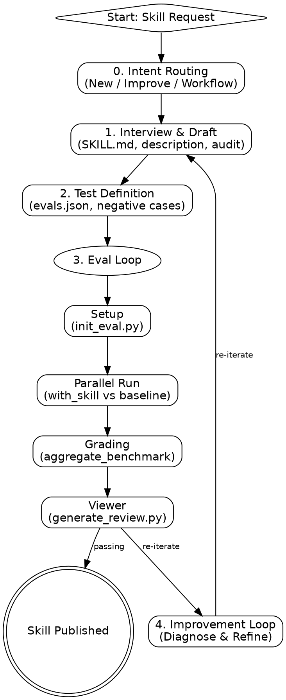

# skill-builder

Lifecycle management for Claude Agent Skills. Optimized for performance and triggering reliability.

## Process Flow

## 0. Intent Routing

- **New Skill:** [Interview and Draft](#step-1-interview--draft)
- **Workflow to Skill:** Extract steps, then [Draft](#step-1-interview--draft)
- **Improve/Fix:** [Diagnosis & Iteration](#step-3-eval-loop)
- **Quick Build:** Draft directly, skip formal evals.

## Step 1: Interview & Draft

1. **Extract:** Tools, step sequence, I/O formats, edge cases.
2. **Draft:** Write `SKILL.md` immediately.
   - **name:** kebab-case, max 64 chars.
   - **description:** \"Pushy\" intent triggers. No angle brackets.
   - **body:** Strict imperative form. No \"you should\" or \"maybe\".
3. **Audit:** Dispatch `general-purpose` agent to check triggering effectiveness.
   - **Red Flags:** Vague triggers, tool overlap with existing skills, nested loops in instructions, missing I/O contracts.

## Step 2: Test Definition

Save cases to `evals/evals.json`.

**Baseline Guidance:**

- **Runs:** Minimum 3 runs per eval case to account for variance.
- **Temperature:** Set `0.0` for deterministic flows, `0.7` for creative drafting.
- **Diversity:** Include at least one \"negative\" case (where skill should NOT trigger).

## Step 3: Eval Loop (Iteration N)

1. **Setup:** `python scripts/init_eval.py --skill-name <name> --eval-id <ID>`
2. **Execute:** Spawn `with_skill` and `baseline` subagents in parallel.
3. **Metrics:** Capture `total_tokens` and `duration_ms` into `timing.json`.
4. **Grade:** Dispatch agent to score assertions. Save to `grading.json`.
5. **Aggregate:** `python -m scripts.aggregate_benchmark <workspace>/iteration-N`
6. **Viewer:** Launch `generate_review.py`. Provide clickable link.

**Error Recovery:**

- **Timeout:** If subagent hangs, check `run_log.txt` in worktree. Rerun with `--timeout 300`.
- **Disk Full:** `skill-builder` creates worktrees. Run `git worktree prune` if space is low.
- **Grading Fail:** If grading agent is hallucinating, manually override `grading.json` and aggregate.

## Step 4: Improvement Loop

1. **Diagnose:** Identify root causes of failures.
2. **Generalize:** Bundle repetitive logic into `scripts/`.
3. **Refine Prompt:** Remove noise; clarify steps.
4. **Rerun:** Execute next iteration in new directory.

## Skill Design Standards

- **Progressive Disclosure:** Headers → Bullets → References.
- **Reference Fences:** Move details to `references/` if body > 500 lines.
- **Imperative Voice:** Commands only. Zero prose explanations.
- **No speculative features:** Justify every line with a requirement.

## Mandatory Rules

- **NEVER** optimize description before logic is stable.
- **NEVER** skip baseline runs for new skills.
- **NEVER** use prose paragraphs in the skill body.
- **NEVER** preload skills with `disable-model-invocation: true`.
- **Subagent isolation:** Use `worktree` for writes.
