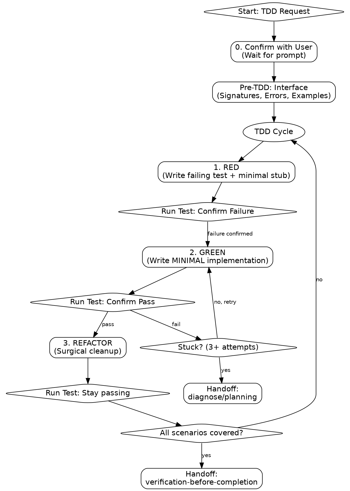

# test-driven-development

Autonomous TDD execution. **HARD GATE:** No implementation code WITHOUT a failing test.

## When NOT to use TDD

- **Exploratory Spikes:** When the implementation path is unknown and you need to "find the shape" of the code first (throwaway code).
- **Trivial One-Liners:** Pure data mappings or standard boilerplate with zero logic.
- **Pure UI/CSS:** Visual styling that requires manual "eye-balling" rather than logical assertions.

## Process Flow

**trigger:** TDD, write tests, implement feature, build this.
**constraint:** No implementation code WITHOUT a failing test.
**constraint:** Execute exactly ONE scenario per cycle. No horizontal slicing.

## Step 0: Confirm

**action: TDD Confirmation**
Confirm the start of an autonomous session via `AskUserQuestion`:

1. ✅ **Recommended** — Proceed with TDD for [specific function/feature].
2. **Alternative** — [Alternative approach] + reason.
3. **Other** — Custom response.

## Step 1: Pre-TDD Interface

**action: Document Interface**
Propose and confirm the public surface via `AskUserQuestion`:

1. ✅ **Recommended** — Signature: [name(params) -> return_type] based on [requirements/conventions].
2. **Alternative** — [Alternative Signature] + justification.
3. **Other** — Custom signature.

4. **Error Cases:** Explicit exception types.
5. **Usage:** 2-3 realistic scenarios.
6. **Target:** Identify test file path.

## Step 2: RED (Failing Test)

**MANDATORY:** For JavaScript/TypeScript projects, read [js-ts-patterns.md](references/js-ts-patterns.md) before writing the first test.

**action:** Write simplest test for single core behavior.
**action:** Write minimal stub to allow compilation (e.g., `pass`, `return null`).
**action:** Run test.
**gate:** Confirm failure (Assertion Fail). If pass, delete and rewrite.

### N-1 Test (False-Green Elimination)

A test that never fails proves nothing. Before trusting any GREEN result (here or in `verification-before-completion`):

1. **Revert** the implementation change (stash or comment it out) while keeping the test.
2. **Fail** — run the test, confirm it fails. If it still passes, the test is not exercising the behavior; rewrite it.
3. **Fix** — restore the implementation.
4. **Pass** — run the test again, confirm it passes.

Use this whenever a test's failure mode is non-obvious (e.g., async code, mocked boundaries, snapshot tests).

## Step 3: GREEN (Minimal Implementation)

**MANDATORY:** Read [minimal-impl-examples.md](references/minimal-impl-examples.md) to understand the "absolute minimum" constraint.

**action:** Commit/stash before editing.
**action:** Write **absolute minimum** code to pass the test.
**constraint:** No speculative abstractions or "just-in-case" logic.
**escalation:** If stuck 3+ attempts, revert and write a smaller test.
**escalation:** If still stuck, invoke `diagnose` or `planning`.

## Step 4: REFACTOR (Cleanup)

**MANDATORY:** Refer to [full-cycle-example.md](references/full-cycle-example.md) for an example of proper REFACTOR timing.

**gate:** Enter ONLY when tests are GREEN.
**action:** Perform surgical improvements (Rename, Decompose, Flatten, DRY).
**constraint:** Refactor and Implementation must be separate tool calls. Run tests between them.

**next skills:**

- `verification-before-completion`: Once all scenarios are covered and passing, to perform final regression sweeps and manual verification.

**transition:** Invoke `verification-before-completion` after final REFACTOR pass.

## Mandatory Rules

**constraint:** Never mock internal collaborators. Mock only at system boundaries (API, DB, I/O).
**constraint:** Never bypass public interfaces for setup.
**constraint:** Never write multiple tests before implementing the first one.
**constraint:** Never skip "Run Test" between RED and GREEN.

## Transition

**next:** Invoke `verification-before-completion` after final REFACTOR pass.
