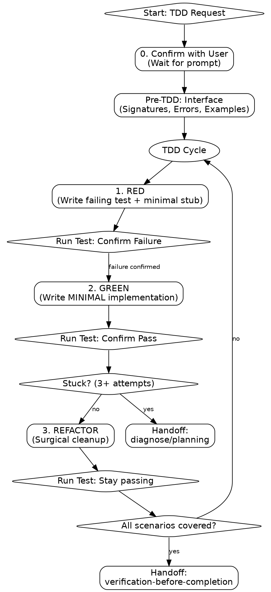

# test-driven-development

Autonomous TDD execution. **HARD GATE:** No implementation code WITHOUT a failing test.

## Process Flow

**trigger:** TDD, write tests, implement feature, build this.
**constraint:** No implementation code WITHOUT a failing test.
**constraint:** Execute exactly ONE scenario per cycle. No horizontal slicing.

## Step 0: Confirm

**action:** Output "This will start an autonomous session (~N calls). Proceed?"
**gate:** Wait for explicit user confirmation.

## Step 1: Pre-TDD Interface

**action:** Document public surface:

1. **Signatures:** `name(params) -> return_type`
2. **Error Cases:** Explicit exception types.
3. **Usage:** 2-3 realistic scenarios.
4. **Target:** Identify test file path.

## Step 2: RED (Failing Test)

**action:** Write simplest test for single core behavior.
**action:** Write minimal stub to allow compilation (e.g., `pass`, `return null`).
**action:** Run test.
**gate:** Confirm failure (Assertion Fail). If pass, delete and rewrite.

## Step 3: GREEN (Minimal Implementation)

**action:** Commit/stash before editing.
**action:** Write **absolute minimum** code to pass the test.
**constraint:** No speculative abstractions or "just-in-case" logic.
**escalation:** If stuck 3+ attempts, revert and write a smaller test.
**escalation:** If still stuck, invoke `diagnose` or `planning`.

## Step 4: REFACTOR (Cleanup)

**gate:** Enter ONLY when tests are GREEN.
**action:** Perform surgical improvements (Rename, Decompose, Flatten, DRY).
**constraint:** Refactor and Implementation must be separate tool calls. Run tests between them.

## Mandatory Rules

**constraint:** Never mock internal collaborators. Mock only at system boundaries (API, DB, I/O).
**constraint:** Never bypass public interfaces for setup.
**constraint:** Never write multiple tests before implementing the first one.
**constraint:** Never skip "Run Test" between RED and GREEN.

## Transition

**next:** Invoke `verification-before-completion` after final REFACTOR pass.
