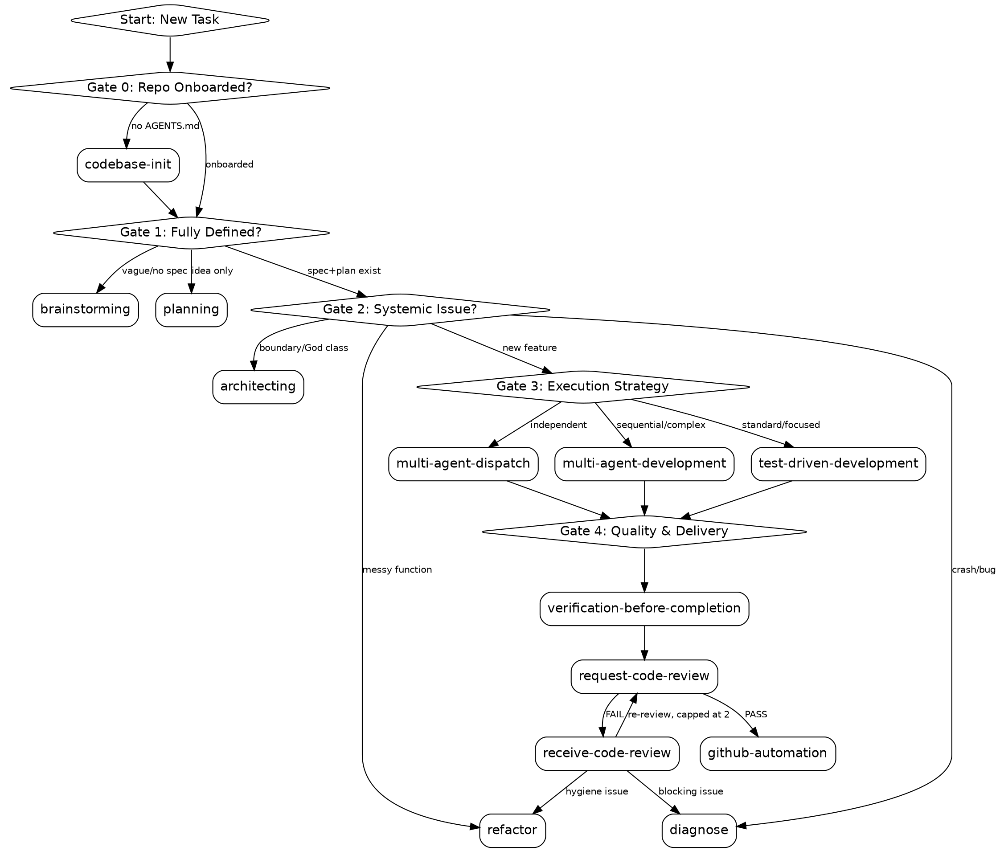

# using-agent-dev-skills

Global entry point for agent-dev plugin coordination. Follow this gated diagnostic flow for ALL tasks to ensure optimal skill routing.

## When to Use

## Rules

1. **Run Diagnostic Gates:** Evaluate the current task through the 3-Gate decision tree before any action.
2. **Skill Shadowing Check:** Before invoking a skill, verify that the local version in `skills/` is active. If the system is using a global version (e.g. from `~/.gemini/skills/`) that differs from the local one, warn the user.
3. **Invoke Immediately:** Once a route is identified, immediately activate and follow that skill.

**action: Notify Route**
Announce the identified route and confirm via `AskUserQuestion`:

1. ✅ **Recommended** — Routing to [`<skill-name>`]: [reason] based on [gate evaluation].
2. **Alternative** — Routing to [Alternative Skill] + justification.
3. **Other** — Manual intent application.

4. **No Skips:** Do NOT skip because a task seems \"simple\" or \"quick\". Every change deserves the appropriate rigor.

## Diagnostic Decision Tree

### Gate 0: Is the repo onboarded?

- **IF** no `AGENTS.md`/`CLAUDE.md` exists at the repo root:
  -> **ROUTE TO:** `codebase-init`. Note: this skill has `disable-model-invocation: true` — it must be explicitly invoked by the user, not auto-triggered. Surface it as a recommendation, not an automatic route.
- **IF** the repo is already onboarded:
  -> **Proceed to Gate 1.**

### Gate 1: Is the task fully defined?

- **IF** the user has a vague idea, OR if there is no documented specification:
  -> **ROUTE TO:** `brainstorming`
- **IF** there is an idea, but we need a concrete execution plan and architecting:
  -> **ROUTE TO:** `planning`
- **IF** the spec and plan exist:
  -> **Proceed to Gate 2.**

### Gate 2: Is this a systemic issue or localized?

- **IF** the code has circular dependencies, \"God classes\", or boundary violations:
  -> **ROUTE TO:** `architecting`
- **IF** the issue is localized to a messy function or single file:
  -> **ROUTE TO:** `refactor`
- **IF** we are actively debugging a crash or traceback:
  -> **ROUTE TO:** `diagnose`
- **IF** implementing a planned feature:
  -> **Proceed to Gate 3.**

### Gate 3: Execution Strategy

- **IF** tasks are completely independent (no shared state) AND wall-time is the primary constraint:
  -> **ROUTE TO:** `multi-agent-dispatch`
- **IF** tasks must be done sequentially OR if token-context usage must be minimized:
  -> **ROUTE TO:** `multi-agent-development`
- **IF** tasks are a mixed DAG:
  -> **ROUTE TO:** `multi-agent-development`, instructed to batch the independent tasks into one wave with gated reviews.
- **IF** writing standard code (single focused feature/fix):
  -> **ROUTE TO:** `test-driven-development` ⚠️

⚠️ **Agentic Skill Warning:** `test-driven-development`, `request-code-review`, `multi-agent-development`, and `multi-agent-dispatch` execute autonomously (each dispatches multiple subagent calls). Output `This will start an autonomous session (~N calls). Proceed?` and wait for user confirmation. `multi-agent-development` is the most expensive of these (N tasks × up to 3 subagent phases × up to 2 retries) — never skip its confirmation gate.

### Gate 4: Quality & Delivery

After Gate 3's execution skill completes:

- **ALWAYS** -> **ROUTE TO:** `verification-before-completion` to gather execution evidence.
- **THEN** -> **ROUTE TO:** `request-code-review` (mandatory for non-trivial changes — it is the only security gate in the multi-agent-development flow).
  - **IF PASS** -> **ROUTE TO:** `github-automation` to open the PR. Note: `disable-model-invocation: true` — this is a deliberate human-invoked delivery gate, not an automatic hop.
  - **IF FAIL** -> **ROUTE TO:** `receive-code-review` to process feedback, which may loop back to `diagnose` (blocking issues) or `refactor` (hygiene), then re-review (capped at 2 cycles before escalating to the user).

## Mandatory Rules (NEVER List)

- **NEVER** route to `test-driven-development` if Gate 1 (spec/plan) is not fully GREEN.
- **NEVER** skip `architecting` for `refactor` if changes span 3+ files or cross module boundaries.
- **NEVER** use `multi-agent-dispatch` if tasks have _any_ shared mutable state or logical dependencies.
- **NEVER** ignore the `diagnose` step when a bug is encountered during a feature implementation.
- **NEVER** treat Gate 4 (`request-code-review`) as optional after `multi-agent-development` — its quality gate does not check security; `request-code-review` is the only skill in the ecosystem that does.
- **NEVER** auto-invoke `codebase-init` or `github-automation` — both have `disable-model-invocation: true` by design. Recommend them; let the user trigger them.

**next skills:**

- All skills in the `agent-dev` ecosystem are potential successors depending on the diagnostic route identified.

## Reference Library

- **Lifecycle:** [lifecycle.md](references/lifecycle.md) (Mermaid diagram and state transitions).

## Auxiliary Skills

- **Quality/Validation:** `verification-before-completion`, `request-code-review`, `receive-code-review` — see Gate 4.
- **Delivery:** `github-automation` — see Gate 4.
- **Repo Onboarding:** `codebase-init` — see Gate 0.
- **Ecosystem Building:** `skill-builder` — top-level entry point for building/improving skills themselves; not part of the product-code workflow, so it has no gate in this tree.

## Skip Disclaimer

If a skill is missing: `The \`<skill-name>\` skill is not installed. Proceeding without it.` then apply intent manually.
