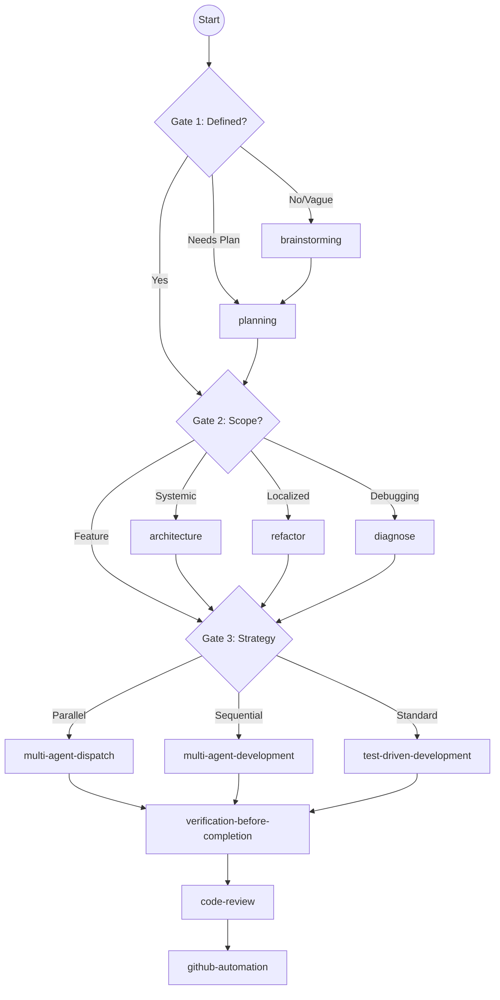

# using-agent-dev-skills

Global entry point for agent-dev plugin coordination. Follow this gated diagnostic flow for ALL tasks to ensure optimal skill routing.

## Rules

1. **Run Diagnostic Gates:** Evaluate the current task through the 3-Gate decision tree before any action.
2. **Invoke Immediately:** Once a route is identified, immediately activate and follow that skill.
3. **Notify:** Output one line: `Routing to \`<skill-name>\`: <reason>.`
4. **No Skips:** Do NOT skip because a task seems "simple" or "quick". Every change deserves the appropriate rigor.

## Diagnostic Decision Tree

### Gate 1: Is the task fully defined?

- **IF** the user has a vague idea, OR if there is no documented specification:
  -> **ROUTE TO:** `brainstorming`
- **IF** there is an idea, but we need a concrete execution plan and architecture:
  -> **ROUTE TO:** `planning`
- **IF** the spec and plan exist:
  -> **Proceed to Gate 2.**

### Gate 2: Is this a systemic issue or localized?

- **IF** the code has circular dependencies, "God classes", or boundary violations:
  -> **ROUTE TO:** `architecture`
- **IF** the issue is localized to a messy function or single file:
  -> **ROUTE TO:** `refactor`
- **IF** we are actively debugging a crash or traceback:
  -> **ROUTE TO:** `diagnose`
- **IF** implementing a planned feature:
  -> **Proceed to Gate 3.**

### Gate 3: Execution Strategy

- **IF** tasks are completely independent (no shared state):
  -> **ROUTE TO:** `multi-agent-dispatch`
- **IF** tasks must be done sequentially:
  -> **ROUTE TO:** `multi-agent-development`
- **IF** writing standard code (single focused feature/fix):
  -> **ROUTE TO:** `test-driven-development` ⚠️

⚠️ **Agentic Skill Warning:** `test-driven-development` and `code-review` execute autonomously. Output `This will start an autonomous session (~N calls). Proceed?` and wait for user confirmation.

## Auxiliary Skills

- **Quality/Validation:** `verification-before-completion`, `code-review`.
- **Delivery:** `github-automation`.
- **Ecosystem Building:** `skill-builder`, `create-agent`, `create-hook`.
- **Documentation:** `agents-maintainer`.

## Lifecycle Chain

## Skip Disclaimer

If a skill is missing: `The \`<skill-name>\` skill is not installed. Proceeding without it.` then apply intent manually.
