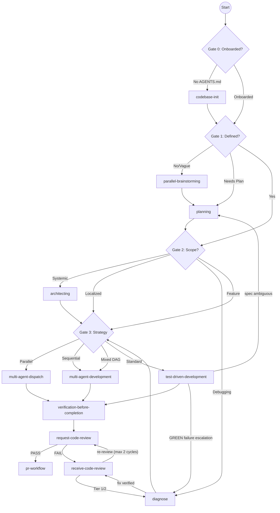

# Agent-SDLC Lifecycle

## Lifecycle Chain

## Transition States

- **TDD Escalation:** If TDD fails to pass after 3 attempts, it must return to `diagnose` or `planning`. This is now reflected directly in `SKILL.md`'s Gate 3 text.
- **Review Failure:** `receive-code-review` analyzes the failure level and routes back to the appropriate corrective skill, using `request-code-review`'s Tier classification (`references/patterns.md` in that skill): Tier 1 = Security, Tier 2 = Correctness, Tier 3 = Performance, Tier 4 = Reuse/hygiene. Tier 1/2 findings route to `diagnose`; Tier 4 findings are fixed inline by `receive-code-review` itself; Tier 3 findings are non-blocking and require no escalation. `SKILL.md`'s Gate 4 describes this same routing using "blocking issue"/"hygiene issue" wording rather than tier numbers — both describe the same logic.
- **Re-review Cap:** Once `diagnose` verifies its fix (or `receive-code-review` fixes a Tier 4 item inline), control returns to `receive-code-review`, which re-invokes `request-code-review` for a fresh-context re-review of the same range. This cycle is capped at 2 re-reviews before escalating to the user — `receive-code-review`'s own doc states this cap directly so the limit isn't only discoverable via the orchestrator.
