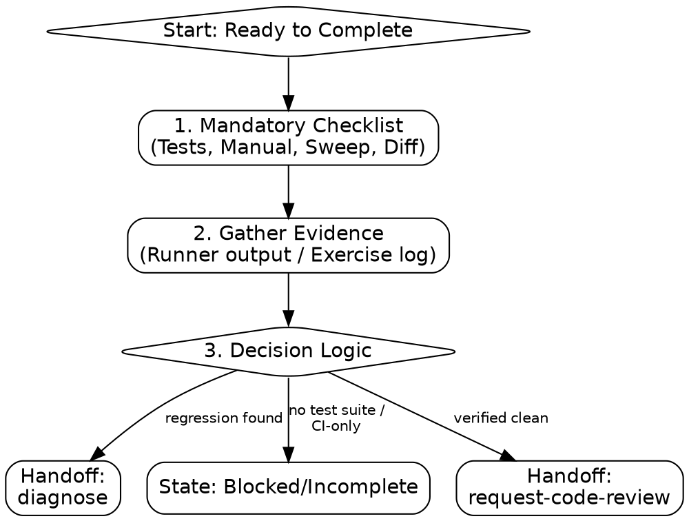

# verification-before-completion

Guarantee operational correctness through execution evidence. **NEVER** confirm based on reading code alone.

## Process Flow



**trigger:** user says "ready", "mark as done", "looks good", or task is complete.
**constraint:** never confirm based on reading code alone.
**output:** verification evidence (test results or manual log).

## 1. Mandatory Checklist

**action:** Verify all items before completion.

- [ ] **Tests:** Targeted tests and regression suite pass.
- [ ] **Manual:** Documented inputs/outputs if no automation.
- [ ] **Bug Fix:** Confirm reproduction failure then confirm success.
- [ ] **Clean:** `grep` sweep for debug logs/tags (`debugger`, `pdb`, `TODO`).
- [ ] **Lint:** No new unused imports or variables.
- [ ] **Diff:** Audit every change for intent.

## 2. Decision Logic

| Status             | Action                                            |
| :----------------- | :------------------------------------------------ |
| **CI-Only**        | Stop. Report: "Blocked by CI. Wait for pipeline." |
| **No Test Suite**  | Mark as **INCOMPLETE**. Document rationale.       |
| **Regression**     | Stop. Invoke `diagnose`.                          |
| **Verified Clean** | Transition to `request-code-review`.              |

## 3. Manual Verification Template

**format:**

```markdown
### Manual Verification

**input:** [Specific values]
**expected:** [Observed side-effect]
**observed:** [Actual behavior]
**status:** PASS/FAIL
```

## 4. Critical Failure Modes

**avoid:**

- **Confidence:** "It should work" is not evidence.
- **Green-Wash:** Mocks hiding actual logic or missing assertions.
- **Shadow Regressions:** Distant modules broken by global state changes.

## 5. Expert Patterns

**action:** Use N-1 test (as defined in `test-driven-development`) to eliminate false greens (Revert → Fail → Fix → Pass).
**action:** Test `null`, `undefined`, empty collections, and boundary cases to ensure robust coverage.

## Transition

**next:** Invoke `request-code-review` for all non-trivial changes.
